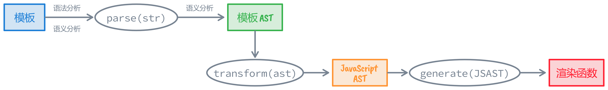
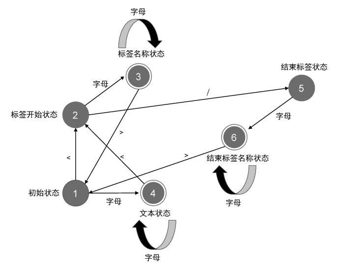
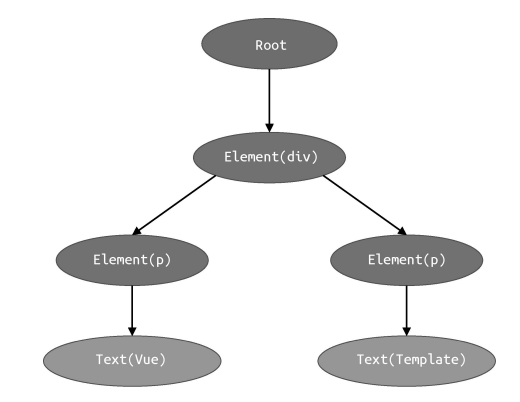

# 编译器

## 模板 DSL 的编译器

>  编译器将源代码翻译为目标代码的过程叫做编译。

Vue 编译器将组件的**模板代码**翻译成能在平台上运行 JavaScript 代码（**渲染函数**）。

```javascript
const template = `
	<div>
  	<h1 v-if="ok">Vue Template</h1>
	</div>
`
const templateAST = parse(template) 
const jsAST = transform(templateAST)
const code = generate(jsAST)
```




> AST ( abstract syntax tree ) 抽象语法树。

模板 AST 就是用来描述模板的抽象语法树，是一个具**有层级结构的对象**，具有与模板同构的嵌套结构。 

例如以下模板：

```html
<div>
  <h1 v-if="ok">Vue Template</h1>
</div>
```

被编译为如下所示 AST ：

```javascript
const ast = {
  // 逻辑根节点
  type: 'Root',
  children: [
    // div 标签节点
    {
      type: 'Element',
      tag: 'h1',
      props: [
        // v-if 指令节点
        {
          type: 'Directive',
          name: 'if',
          exp: {
            // 表达式节点
            type: 'Expression',
            content: 'ok'
          }
        }
      ]
    }
  ]
}
```

## parser 的实现原理与状态机

解析器 parser 的入参是字符串模板

有限状态自动机对模板**标记化**：会逐个读取字符串模板中的字符，并根据一定规则将整个字符串切割为一个个 Token。

Token 视作词法记号。假设有这样的一段模板：

```html
<p>Vue</p>
```

解析器会把这段字符串模板切割为三个 Token：

- 开始标签：`<p>`
- 文本节点：Vue
- 结束标签：`</p>`

**有限状态自动机**：随着字符串的输入，解析器自动地在不同状态间迁移。



```javascript
const tokens = tokenize(`<p>Vue</p>`)
// [
//   { type: 'tag', name: 'p' },
//   { type: 'text', content: 'Vue' },
//   { type: 'tagEnd', name: 'p' }
// ]
```

正则表达式的本质就是有限自动机

## 构造模板 AST

根据 Token 列表构建模板 AST——对 Token 列表进行顺序扫描。

假如有如下模板：

```html
<div><p>Vue</p><p>Template</p></div>
```

标记化得到如下 tokens：

```javascript
const tokens = [
  {type: 'tag', name: 'div'},       	 // div 开始标签节点
  {type: 'tag', name: 'p'},						 // p 开始标签节点
  {type: 'text', content: 'Vue'},   	 // 文本节点
  {type: 'tagEnd', name: 'p'},				 // p 结束标签节点
  {type: 'tag', name: 'p'},						 // p 开始标签节点
  {type: 'text', content: 'Template'}, // 文本节点
  {type: 'tagEnd', name: 'p'},				 // p 开始标签节点
  {type: 'tagEnd', name: 'div'},       // div 结束标签节点
]
```

模板 AST 树形结构（与模板同构）：



在这个过程中需要维护一个栈 `elementStack`，用于维护元素间的父子关系。每遇到一个开始标签节点，就构造一个 `Element` 类型的 AST 节点，并将其压入栈中，每遇到一个结束标签节点，我们就将当前栈顶的节点弹出。这样，栈顶的节点始终充当父节点的角色。

TODO：过程图

## AST 的转换与插件化架构

​                                                                                                                                                                                                                                                                                                                                                                                                                                                                                                                                                                                                                    

