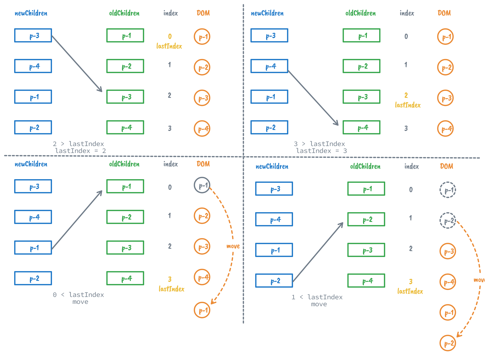

# diff 算法

## 简单 diff

在渲染器章节中，我们提到了对子节点进行打补丁，当新旧子节点都是数组时，我们可采取卸载全部旧子节点，挂载全部新子节点，但是显然这样的方式效率太低，所以我们需要 diff 算法来提高效率，减少 DOM 操作的性能开销。

可以想到最简单的算法是遍历数组，对新旧子节点逐个比较进行补丁。


然而这种方式虽然可以减少 DOM 操作的次数提高新能，但是仍然可以优化。

### DOM 复用与 `key` 的作用

如果新旧子节点中的某些节点只是顺序发生了变化，那么以上方式会造成很大的性能浪费。

最优的处理方式应该使通过 **DOM 的移动**来完成子节点的更新，这比不断执行子节点的卸载和挂载性能更好。但这必须要保证一个前提：**新旧两组子节点中存在可复用的节点**

所以如何确定新的子节点是否出现在旧的一组子节点中呢？引入额外的 `key` 来作为 `vnode` 的标识，如下面代码所示：

```javascript
// oldChildren
[
  { type: 'p', children: '1', key: 1 },
  { type: 'p', children: '2', key: 2 },
  { type: 'p', children: '3', key: 3 }
]
// newChildren
[
  { type: 'p', children: '3', key: 3 },
  { type: 'p', children: '1', key: 1 },
  { type: 'p', children: '2', key: 2 }
]
```

`key` 属性就是虚拟节点的身份证，只要两个虚拟节点的 `type` 属性值和 `key` 属性值都相同，那么我们认为它们使相同的，即可以进行 DOM 复用。


```javascript
function patchChildren(n1, n2, container) {
  // 当新子节点是文本节点类型
  if (typeof n2.children === 'string') {
    // 省略
  } else if (Array.isArray(n2.children)) {
    // 当新子节点是一组子节点
    // 判断旧子节点是否也是一组子节点
    if (Array.isArray(n1.children)) {
      const oldChildren  = n1.children
      const newChildren = n2.children

      // 遍历新的 children
      for(let i = 0;i < newChildren.length;i++){
        const newVnode = newChildren[i]
        // 遍历旧的 children
        for(let j = 0;j < oldChildren.length;j++){
          const oldVnode = oldChildren[j]
          // 如果找到具有相同 key 值的两个节点，说明可以复用，但仍然需要调用 patch 函数更新
          if(newVnode.key === oldVnode.key){
            patch(oldVnode, newVnode, container)
            break // 这里找到了可复用节点，结束
          }
        }
      }
    } else {
      // 省略
    }
  } else {
    // 省略
  }
}
```

### 找到需要移动的元素

> 和插入排序有些类似

我们根据递增的顺序遍历新子节点，在旧子节点中寻找具有相同 `key` 值节点的索引值，如果在寻找过程中，存在索引值比当前遇到的最大索引值还要小的节点，索引值递增的顺序被打破了，则意味着该节点需要移动。



基本思想就是先找到在旧子节点中的可复用元素，如果无法保证递增索引序列（和新子节点的递增遍历顺序不一致），则移动旧子节点对应的真实DOM 元素使其符合序列递增要求。

```javascript
function patchChildren(n1, n2, container) {
  if (typeof n2.children === 'string') {
    // 省略
  } else if (Array.isArray(n2.children)) {
    if (Array.isArray(n1.children)) {
      const oldChildren = n1.children
      const newChildren = n2.children
      
      // 用来存储寻找过程中遇到的最大索引值
      let lastIndex = 0 // [!code ++]
      for (let i = 0; i < newChildren.length; i++) {
        const newVnode = newChildren[i]
        for (let j = 0; j < oldChildren.length; j++) {
          const oldVnode = oldChildren[j]
          if (newVnode.key === oldVnode.key) {
            patch(oldVnode, newVnode, container)
            if (j < lastIndex) { // [!code ++]
              // 如果当前找到的节点在旧 children 中的索引小于最大索引值 lastIndex
              // 说明该节点对应的真实 DOM 元素需要移动
            } else { // [!code ++]
              // 如果当前找到的节点在旧 children 中的索引不小于最大索引值 lastIndex
              // 则更新 lastIndex 的值
              lastIndex = j // [!code ++]
            } // [!code ++]
            break // 这里找到了可复用节点，结束
          }
        }
      }
    } else {
			// 省略
    }
  } else {
		// 省略
  }
}
```

### 移动元素

我们知道，当一个虚拟节点被挂载后，其对应的真实 DOM 节点会存储在它的 `vnode.el` 属性中。当更新操作发生时，渲染器会调用 `patchElement` 函数在新旧虚拟节点之间进行补丁，其中会执行 `const el = n2.el = n1.el` ，将旧节点的 `n1.el` 属性赋值给新节点的 `n2.el` 属性，真正含义就是 DOM 元素的**复用**。

当我们遍历新子节点过程中发现一个需要移动的可复用节点时，可以保证已经被访问过的新子节点对应的真实 DOM 元素排列是有序的，所以我们只需要找到上一个新子节点对应的真实 DOM 元素，并将需要移动的元素插入到它后方就行了。

```javascript
function patchChildren(n1, n2, container) {
  if (typeof n2.children === 'string') {
    // 省略
  } else if (Array.isArray(n2.children)) {
    if (Array.isArray(n1.children)) {
      const oldChildren = n1.children
      const newChildren = n2.children
      
      // 用来存储寻找过程中遇到的最大索引值
      let lastIndex = 0 // [!code ++]
      for (let i = 0; i < newChildren.length; i++) {
        const newVnode = newChildren[i]
        for (let j = 0; j < oldChildren.length; j++) {
          const oldVnode = oldChildren[j]
          if (newVnode.key === oldVnode.key) {
            patch(oldVnode, newVnode, container)
            if (j < lastIndex) { // [!code focus:12]
              // 代码运行到这里，说明 newVnode 对应的真实 DOM 需要移动
                // 先获取 newVnode 的前一个 vnode，即 prevVnode
                const prevVnode = newChildren[i - 1]
                // 如果 prevVnode 不存在，说明当前 newVnode 是第一个节点，它不需要移动
                if (prevVnode) {
                  // 由于我们要将 newVnode 对应的真实 DOM 移动到 prevVnode 所对应的真实 DOM 后面
                  // 所以我们需要获取 prevVnode 所对应真实 DOM 的下一个兄弟节点，并将其作为锚点
                  const anchor = prevVnode.el.nextSibling
                  // 调用 insert 方法将 newVnode 对应的真实 DOM 插入到锚点元素前面
                  insert(newVnode.el, container, anchor)
                }
            } else { 
              // 如果当前找到的节点在旧 children 中的索引不小于最大索引值 lastIndex
              // 则更新 lastIndex 的值
              lastIndex = j 
            } 
            break // 这里找到了可复用节点，结束
          }
        }
      }
    } else {
			// 省略
    }
  } else {
		// 省略
  }
}
```

### 添加新元素

如果在旧子节点中找不到相同 `key` 值的旧子节点，渲染器会把它看作新增节点进行挂载。和移动节点类似，只需挂载它的上一个节点对应的真实 DOM 后面。


```javascript
function patchChildren(n1, n2, container) {
  if (typeof n2.children === 'string') {
    // 省略
  } else if (Array.isArray(n2.children)) {
    if (Array.isArray(n1.children)) {
      const oldChildren = n1.children
      const newChildren = n2.children
      
      let lastIndex = 0
      for (let i = 0; i < newChildren.length; i++) {
        const newVnode = newChildren[i]
        let find = false // [!code ++]
        for (let j = 0; j < oldChildren.length; j++) {
          const oldVnode = oldChildren[j]
          if (newVnode.key === oldVnode.key) {
            find = true // [!code ++]
            patch(oldVnode, newVnode, container)
            if (j < lastIndex) { 
                const prevVnode = newChildren[i - 1]
                if (prevVnode) {
                  const anchor = prevVnode.el.nextSibling
                  insert(newVnode.el, container, anchor)
                }
            } else { 
              lastIndex = j 
            } 
            break 
          }
          // 代码运行到这里 find 仍然为 false // [!code focus:19]
          // 说明当前 newVnode 没有在旧的一组子节点中找到可复用节点
          // 也就是说当前 newVnode 是新增节点，需要挂载
          if (!find) {
            // 为了将节点挂载到正确位置，我们需要先获取锚点元素
            // 首先获取当前 newVnode 的前一个 vnode 节点
            const prevVnode = newChildren[i - 1]
            let anchor = null
            if (prevVnode) {
              // 如果有前一个 vnode 节点，则使用它的下一个兄弟节点作为锚点元素
              anchor = prevVnode.el.nextSibling
            } else {
              // 如果没有前一个 vnode 节点，说明即将挂载的新节点是第一个子节点
              // 这时我们使用容器元素的 firstChild 作为锚点
              anchor = container.firstChild
            }
            // 挂载 newVnode
            patch(null, newVnode, container, anchor)
          }
        }
      }
    } else {
			// 省略
    }
  } else {
		// 省略
  }
}
```

调整 `patch` 支持锚点挂载：

```javascript
// patch 函数需要接收第四个参数，即锚点元素
function patch(n1, n2, container, anchor) {
  if (n1 && n1.type !== n2.type) {
    unmount(n1)
    n1 = null
  }
  const { type } = n2
  if (typeof type === 'string') {
    if (!n1) {
      // 挂载时将锚点元素作为第三个参数传递给 mountElement 函数
      mountElement(n2, container, anchor) // [!code hl]
    } else {
      patchElement(n1, n2)
    }
  } else if (typeof type === Text) {
    // 省略
  } else if (typeof type === Fragment) {
    if (!n1) {
      n2.children.forEach(c => patch(null, c, container))
    } else {
      patchChildren(n1, n2, container)
    }
  }
}
// mountElement 函数需要接收第三个参数，即锚点元素
function mountElement(vnode, container, anchor) {
 	// 省略部分代码
  
  // 调用 insert 函数将元素插入到容器内
  insert(el, container, anchor) // [!code hl]
}
```

### 移除不存在元素

在遍历完新子节点后，旧子节点中可能会有多余的不可复用节点，这些节点对应的真实 DOM 元素需要卸载。


```javascript
function patchChildren(n1, n2, container) {
  if (typeof n2.children === 'string') {
    // 省略
  } else if (Array.isArray(n2.children)) {
    if (Array.isArray(n1.children)) {
      const oldChildren = n1.children
      const newChildren = n2.children
      
      let lastIndex = 0
      for (let i = 0; i < newChildren.length; i++) {
        // 省略代码
      }
      // 上一步的更新操作完成后 // [!code focus:13]
      // 遍历旧子节点
      for(let i = 0;i < oldChildren.length;i++){
        const oldVnode = oldChildren[i]
        // 拿旧子节点 oldVnode 去新子节点中寻找具有相同 key 值的节点
        const has = newChildren.find(
          vnode => vnode.key === oldVnode.key
        )
        if(!has){
          // 如果没有找到具有相同 key 值的节点，则说明需要删除该节点
          unmount(oldVnode)
        }
      }
    } else {
			// 省略
    }
  } else {
		// 省略
  }
}
```

## 双端 diff


## 快速 diff

