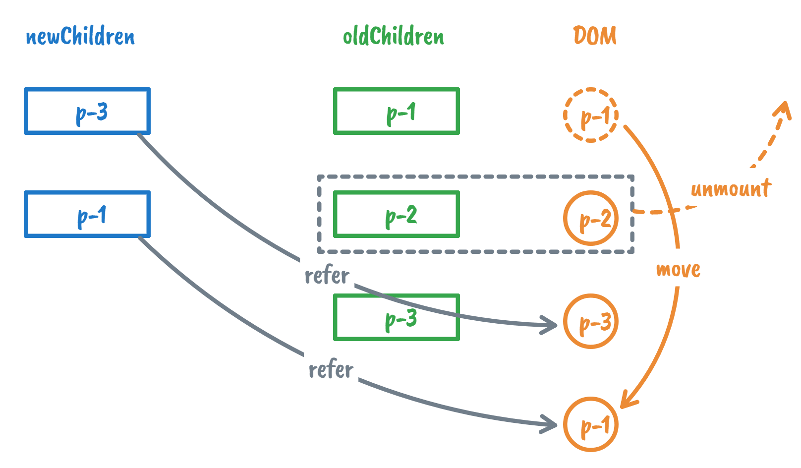
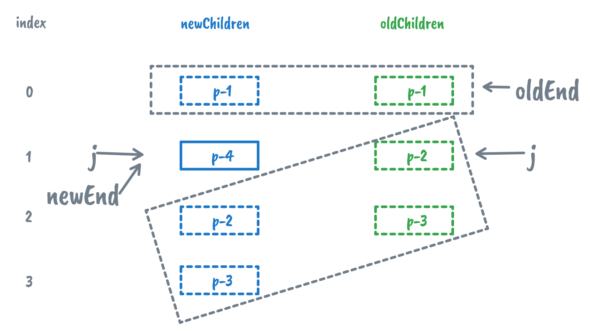

# Diff 算法

> 本文是阅读《Vue.js 设计与实现》（霍春阳）第九、十、十一章后的一些总结和思考，部分文本和代码片段来自原文，书中包含更多细节。

## 简单 Diff

在渲染器章节中，我们提到了对子节点进行打补丁，当新旧子节点都是数组时，我们可采取卸载全部旧子节点，挂载全部新子节点，但是显然这样的方式效率太低，所以我们需要 Diff 算法来提高效率，减少 DOM 操作的性能开销。

可以想到最简单的算法是遍历数组，对新旧子节点逐个比较进行补丁。


然而这种方式虽然可以减少 DOM 操作的次数提高新能，但是仍然可以优化。

### DOM 复用与 `key` 的作用

如果新旧子节点中的某些节点只是顺序发生了变化，那么以上方式会造成很大的性能浪费。

最优的处理方式应该使通过 **DOM 的移动**来完成子节点的更新，这比不断执行子节点的卸载和挂载性能更好。但这必须要保证一个前提：**新旧两组子节点中存在可复用的节点**

所以如何确定新的子节点是否出现在旧的一组子节点中呢？引入额外的 `key` 来作为 `vnode` 的标识，如下面代码所示：

```javascript
// oldChildren
[
  { type: 'p', children: '1', key: 1 },
  { type: 'p', children: '2', key: 2 },
  { type: 'p', children: '3', key: 3 }
]
// newChildren
[
  { type: 'p', children: '3', key: 3 },
  { type: 'p', children: '1', key: 1 },
  { type: 'p', children: '2', key: 2 }
]
```

`key` 属性就是虚拟节点的身份证，只要两个虚拟节点的 `type` 属性值和 `key` 属性值都相同，那么我们认为它们使相同的，即可以进行 DOM 复用。


```javascript
function patchChildren(n1, n2, container) {
  // 当新子节点是文本节点类型
  if (typeof n2.children === 'string') {
    // 省略
  } else if (Array.isArray(n2.children)) {
    // 当新子节点是一组子节点
    // 判断旧子节点是否也是一组子节点
    if (Array.isArray(n1.children)) {
      const oldChildren  = n1.children
      const newChildren = n2.children

      // 遍历新的 children
      for(let i = 0;i < newChildren.length;i++){
        const newVnode = newChildren[i]
        // 遍历旧的 children
        for(let j = 0;j < oldChildren.length;j++){
          const oldVnode = oldChildren[j]
          // 如果找到具有相同 key 值的两个节点，说明可以复用，但仍然需要调用 patch 函数更新
          if(newVnode.key === oldVnode.key){
            patch(oldVnode, newVnode, container)
            break // 这里找到了可复用节点，结束
          }
        }
      }
    } else {
      // 省略
    }
  } else {
    // 省略
  }
}
```

### 找到需要移动的元素

> 和插入排序有些类似

我们根据递增的顺序遍历新子节点，在旧子节点中寻找具有相同 `key` 值节点的索引值，如果在寻找过程中，存在索引值比当前遇到的最大索引值还要小的节点，索引值递增的顺序被打破了，则意味着该节点需要移动。


基本思想就是先找到在旧子节点中的可复用元素，如果无法保证递增索引序列（和新子节点的递增遍历顺序不一致），则移动旧子节点对应的真实DOM 元素使其符合序列递增要求。

```javascript
function patchChildren(n1, n2, container) {
  if (typeof n2.children === 'string') {
    // 省略
  } else if (Array.isArray(n2.children)) {
    if (Array.isArray(n1.children)) {
      const oldChildren = n1.children
      const newChildren = n2.children
      
      // 用来存储寻找过程中遇到的最大索引值
      let lastIndex = 0 // [!code ++]
      for (let i = 0; i < newChildren.length; i++) {
        const newVnode = newChildren[i]
        for (let j = 0; j < oldChildren.length; j++) {
          const oldVnode = oldChildren[j]
          if (newVnode.key === oldVnode.key) {
            patch(oldVnode, newVnode, container)
            if (j < lastIndex) { // [!code ++]
              // 如果当前找到的节点在旧 children 中的索引小于最大索引值 lastIndex
              // 说明该节点对应的真实 DOM 元素需要移动
            } else { // [!code ++]
              // 如果当前找到的节点在旧 children 中的索引不小于最大索引值 lastIndex
              // 则更新 lastIndex 的值
              lastIndex = j // [!code ++]
            } // [!code ++]
            break // 这里找到了可复用节点，结束
          }
        }
      }
    } else {
			// 省略
    }
  } else {
		// 省略
  }
}
```

### 移动元素

我们知道，当一个虚拟节点被挂载后，其对应的真实 DOM 节点会存储在它的 `vnode.el` 属性中。当更新操作发生时，渲染器会调用 `patchElement` 函数在新旧虚拟节点之间进行补丁，其中会执行 `const el = n2.el = n1.el` ，将旧节点的 `n1.el` 属性赋值给新节点的 `n2.el` 属性，真正含义就是 DOM 元素的**复用**。

当我们遍历新子节点过程中发现一个需要移动的可复用节点时，可以保证已经被访问过的新子节点对应的真实 DOM 元素排列是有序的，所以我们只需要找到上一个新子节点对应的真实 DOM 元素，并将需要移动的元素插入到它后方就行了。

```javascript
function patchChildren(n1, n2, container) {
  if (typeof n2.children === 'string') {
    // 省略
  } else if (Array.isArray(n2.children)) {
    if (Array.isArray(n1.children)) {
      const oldChildren = n1.children
      const newChildren = n2.children
      
      // 用来存储寻找过程中遇到的最大索引值
      let lastIndex = 0 // [!code ++]
      for (let i = 0; i < newChildren.length; i++) {
        const newVnode = newChildren[i]
        for (let j = 0; j < oldChildren.length; j++) {
          const oldVnode = oldChildren[j]
          if (newVnode.key === oldVnode.key) {
            patch(oldVnode, newVnode, container)
            if (j < lastIndex) { // [!code focus:12]
              // 代码运行到这里，说明 newVnode 对应的真实 DOM 需要移动
                // 先获取 newVnode 的前一个 vnode，即 prevVnode
                const prevVnode = newChildren[i - 1]
                // 如果 prevVnode 不存在，说明当前 newVnode 是第一个节点，它不需要移动
                if (prevVnode) {
                  // 由于我们要将 newVnode 对应的真实 DOM 移动到 prevVnode 所对应的真实 DOM 后面
                  // 所以我们需要获取 prevVnode 所对应真实 DOM 的下一个兄弟节点，并将其作为锚点
                  const anchor = prevVnode.el.nextSibling
                  // 调用 insert 方法将 newVnode 对应的真实 DOM 插入到锚点元素前面
                  insert(newVnode.el, container, anchor)
                }
            } else { 
              // 如果当前找到的节点在旧 children 中的索引不小于最大索引值 lastIndex
              // 则更新 lastIndex 的值
              lastIndex = j 
            } 
            break // 这里找到了可复用节点，结束
          }
        }
      }
    } else {
			// 省略
    }
  } else {
		// 省略
  }
}
```

### 添加新元素

如果在旧子节点中找不到相同 `key` 值的旧子节点，渲染器会把它看作新增节点进行挂载。和移动节点类似，只需挂载它的上一个节点对应的真实 DOM 后面。


```javascript
function patchChildren(n1, n2, container) {
  if (typeof n2.children === 'string') {
    // 省略
  } else if (Array.isArray(n2.children)) {
    if (Array.isArray(n1.children)) {
      const oldChildren = n1.children
      const newChildren = n2.children
      
      let lastIndex = 0
      for (let i = 0; i < newChildren.length; i++) {
        const newVnode = newChildren[i]
        let find = false // [!code ++]
        for (let j = 0; j < oldChildren.length; j++) {
          const oldVnode = oldChildren[j]
          if (newVnode.key === oldVnode.key) {
            find = true // [!code ++]
            patch(oldVnode, newVnode, container)
            if (j < lastIndex) { 
                const prevVnode = newChildren[i - 1]
                if (prevVnode) {
                  const anchor = prevVnode.el.nextSibling
                  insert(newVnode.el, container, anchor)
                }
            } else { 
              lastIndex = j 
            } 
            break 
          }
          // 代码运行到这里 find 仍然为 false // [!code focus:19]
          // 说明当前 newVnode 没有在旧的一组子节点中找到可复用节点
          // 也就是说当前 newVnode 是新增节点，需要挂载
          if (!find) {
            // 为了将节点挂载到正确位置，我们需要先获取锚点元素
            // 首先获取当前 newVnode 的前一个 vnode 节点
            const prevVnode = newChildren[i - 1]
            let anchor = null
            if (prevVnode) {
              // 如果有前一个 vnode 节点，则使用它的下一个兄弟节点作为锚点元素
              anchor = prevVnode.el.nextSibling
            } else {
              // 如果没有前一个 vnode 节点，说明即将挂载的新节点是第一个子节点
              // 这时我们使用容器元素的 firstChild 作为锚点
              anchor = container.firstChild
            }
            // 挂载 newVnode
            patch(null, newVnode, container, anchor)
          }
        }
      }
    } else {
			// 省略
    }
  } else {
		// 省略
  }
}
```

调整 `patch` 支持锚点挂载：

```javascript
// patch 函数需要接收第四个参数，即锚点元素
function patch(n1, n2, container, anchor) {
  if (n1 && n1.type !== n2.type) {
    unmount(n1)
    n1 = null
  }
  const { type } = n2
  if (typeof type === 'string') {
    if (!n1) {
      // 挂载时将锚点元素作为第三个参数传递给 mountElement 函数
      mountElement(n2, container, anchor) // [!code hl]
    } else {
      patchElement(n1, n2)
    }
  } else if (typeof type === Text) {
    // 省略
  } else if (typeof type === Fragment) {
    if (!n1) {
      n2.children.forEach(c => patch(null, c, container))
    } else {
      patchChildren(n1, n2, container)
    }
  }
}
// mountElement 函数需要接收第三个参数，即锚点元素
function mountElement(vnode, container, anchor) {
 	// 省略部分代码
  
  // 调用 insert 函数将元素插入到容器内
  insert(el, container, anchor) // [!code hl]
}
```

### 移除不存在元素

在遍历完新子节点后，旧子节点中可能会有多余的不可复用节点，这些节点对应的真实 DOM 元素需要卸载。





```javascript
function patchChildren(n1, n2, container) {
  if (typeof n2.children === 'string') {
    // 省略
  } else if (Array.isArray(n2.children)) {
    if (Array.isArray(n1.children)) {
      const oldChildren = n1.children
      const newChildren = n2.children
      
      let lastIndex = 0
      for (let i = 0; i < newChildren.length; i++) {
        // 省略代码
      }
      // 上一步的更新操作完成后 // [!code focus:13]
      // 遍历旧子节点
      for(let i = 0;i < oldChildren.length;i++){
        const oldVnode = oldChildren[i]
        // 拿旧子节点 oldVnode 去新子节点中寻找具有相同 key 值的节点
        const has = newChildren.find(
          vnode => vnode.key === oldVnode.key
        )
        if(!has){
          // 如果没有找到具有相同 key 值的节点，则说明需要删除该节点
          unmount(oldVnode)
        }
      }
    } else {
			// 省略
    }
  } else {
		// 省略
  }
}
```

## 双端 Diff

简单 Diff 算法仍有缺陷，问题在于它对 DOM 的移动操作并不是最优的。例如：


根据简单 Diff 算法，需要移动节点 `p-1` 和 `p-2`，但是这种更新并非是最优解，其实只需要通过一步 DOM 节点的移动操作即可完成更新，即把真实 DOM 节点 `p-3` 移动到真实 DOM 节点 `p-1` 前面。

简单 Diff 做不到这一点，需要使用双端 Diff 算法。

### 基本原理

双端 Diff 算法是一种同时对新旧两组子节点的两个端点进行比较的算法。因此，我们需要四个索引值，分别指向新旧两组子节点的端点，然后两两比较对应节点上的  `key` 值，找到可复用节点，如图：


可以分为四种情况（以上述例子分析过程排序）：

> **头部节点**：指头部索引 `newStartIdx` 和 `newStartIdx` 所指向的节点
>
> **尾部节点**：指尾部索引 `newEndIdx` 和 `newEndIdx` 所指向的节点


1. 新子节点的头部节点和旧子节点的尾部节点相同

   这意味着原本是最后一个的子节点在新的顺序中变成了第一个子节点，所以需要将旧尾部节点指向的真实 DOM 移动到旧头部节点指向的真实 DOM 前。

   

   

2. 新子节点的尾部节点和旧子节点的尾部节点相同

   两者都处于尾部，因此不需要对真实 DOM 进行移动操作。

   

3. 新子节点的尾部节点和旧子节点的头部节点相同

   原本是头部节点，但在新的顺序中，它变成了尾部节点，我们需要将就旧头部节点对应真实 DOM 移动到旧尾部节点对应真实 DOM 的后面。

   

4. 新子节点的头部节点和旧子节点的头部节点相同

   两者都是头部节点，不需要移动。

   

   

​	当索引 `newStartIdx` 和索引 `oldStartIdx` 的值都小于 `newEndIdx` 和 `oldEndIdx` 时，循环终止，双端 Diff 算法执行完毕 。

```javascript
function patchChildren(n1, n2, container) {
  // 当新子节点是文本节点类型
  if (typeof n2.children === 'string') {
    // 省略
  } else if (Array.isArray(n2.children)) {
    // 封装 patchKeyedChildren 函数处理两组子节点
    patchKeyedChildren(n1, n2, container) //[!code hl]

  } else {
    // 省略
  }
}

function patchKeyedChildren(n1, n2, container) {
  const oldChildren = n1.children
  const newChildren = n2.children
  // 四个索引值
  let oldStartIdx = 0
  let oldEndIdx = oldChildren.length - 1
  let newStartIdx = 0
  let newEndIdx = newChildren.length - 1
  // 四个索引值指向的 vnode 节点
  let oldStartVnode = oldChildren[oldStartIdx]
  let oldEndVnode = oldChildren[oldEndIdx]
  let newStartVnode = newChildren[newStartIdx]
  let newEndVnode = newChildren[newEndIdx]

  while (oldStartIdx <= oldEndIdx && newStartIdx <= newEndIdx) {
    if (oldStartVnode.key === newStartVnode.key) {
      // 不需要移动
      // 调用 patch 函数在oldStartVnode 与 newStartVnode 之间打补丁
      patch(oldStartVnode, newStartVnode, container)
      // 更新索引，指向下一个位置
      oldStartVnode = oldChildren[++oldStartIdx]
      newStartVnode = newChildren[++newStartIdx]
      
    } else if (oldEndVnode.key === newEndVnode.key) {
      // 不需要移动
      // 打补丁
      patch(oldEndVnode, newEndVnode, container)
      // 更新索引
      oldEndVnode = oldChildren[--oldEndIdx]
      newEndVnode = newChildren[--newEndIdx]
      
    } else if (oldStartVnode.key === newEndVnode.key) {
      patch(oldStartVnode, newEndVnode, container)
      // 将旧的一组子节点的头部节点对应的真实 DOM 元素 oldStartVnode.el 移动到
      // 旧的一组子节点的尾部节点的真实 DOM 节点后面
      insert(oldStartVnode.el, container, oldEndVnode.el.nextSibling)
      // 更新相关索引到下一个位置
      oldStartVnode = oldChildren[++oldStartIdx]
      newEndVnode = newChildren[--newEndIdx]
      
    } else if (oldEndVnode.key === newStartVnode.key) {
      patch(oldEndVnode, newStartVnode, container)
      // oldEndVnode.el 移动到 oldStartVnode.el 前面
      insert(oldEndVnode.el, container, oldStartVnode.el)
      // 更新索引值
      oldEndVnode = oldChildren[++oldEndIdx]
      newStartVnode = newChildren[++newStartIdx]
    }
  }

}
```


### 非理想状况的处理方式

上节中我们使用了一个比较理想的例子，每一轮比较都会命中四个步骤中的一个，即端点都能找到可复用节点。但实际上，并非所有情况都这么理想，以下图为例：


根据双端 Diff 算法的思路进行第一轮比较时，会发现无法命中四个步骤中的任何一步，说明两个头部和两个尾部的四个节点中都没有可复用的节点，那么尝试看看非头部、非尾部的节点能否复用。

具体做法：拿新子节点中的头部节点去旧子节点中寻找可复用节点，若找到则移动对应真实 DOM 到最头部，并将这个旧节点置为 `undefined`（代表已被处理过，再次遍历时直接跳过），最后跟新头部索引：


剩余部分不再逐步分析，和上节同理。

```javascript
while (oldStartIdx <= oldEndIdx && newStartIdx <= newEndIdx) {
  // 增加两个判断分支，如果头尾节点为 undefined，则说明该节点已经被处理过了，直接跳到下一个位置
  if (!oldStartVnode) {
    oldStartVnode = oldChildren[++oldStartIdx]
  } else if (!oldEndVnode) {
    oldEndVnode = oldChildren[--oldEndIdx]
  } else if (oldStartVnode.key === newStartVnode.key) {
    // 省略
  } else if (oldEndVnode.key === newEndVnode.key) {
    // 省略
  } else if (oldStartVnode.key === newEndVnode.key) {
    // 省略
  } else if (oldEndVnode.key === newStartVnode.key) {
    // 省略
  } else { // [!code focus:20]
    // 遍历旧子节点，试图寻找与 newStartVnode 拥有相同 key 值的节点
    // idxInOld 就是新子节点中的头部节点在旧子节点中的索引
    const idxInOld = oldChildren.findIndex(
      node => node.key === newStartVnode.key
    )
    // indexInOld 大于 0，说明找到了可复用的节点，并且需要将其对应的真实 DOM 移动到头部
    if (idxInOld > 0) {
      // idxInOld 位置对应的 vnode 就是需要移动的节点
      const vnodeToMove = oldChildren[idxInOld]
      // 不要忘记除移动操作外还应该打补丁
      patch(vnodeToMove, newStartVnode, container)
      // 将 vnodeToMove.el 移动到头部节点 oldStartVnode.el 之前，使用后者作为锚点
      insert(vnodeToMove.el, container, oldStartVnode.el)
      // 由于位置 idxInOld 处的节点所对应的真实 DOM 已经移动到了别处，因此将其设置为 undefined
      oldChildren[idxInOld] = undefined
      // 最后更新 newStartIdx 到下一个位置
      newStartVnode = newChildren[++newStartIdx]
    }
  }
}
```

### 添加新元素

上节讲到在非理想状态下，尝试拿新子节点的头部节点去旧子节点中寻找相同 `key` 值的可复用节点，如果此时仍然找不到可复用节点，说明该节点时一个新增节点，需要被挂载到正确位置，又因为该节点时新子节点中的头部节点，所以只需要将它挂载到当前头部节点之前即可。

> “ 当前 ”头部节点指的是，旧的一组子节点中的头部节点所对应的真实 DOM 节点

以下图为例：


```javascript
while (oldStartIdx <= oldEndIdx && newStartIdx <= newEndIdx) {
  // 增加两个判断分支，如果头尾节点为 undefined，则说明该节点已经被处理过了，直接跳到下一个位置
  if (!oldStartVnode) {
    oldStartVnode = oldChildren[++oldStartIdx]
  } else if (!oldEndVnode) {
    oldEndVnode = oldChildren[--oldEndIdx]
  } else if (oldStartVnode.key === newStartVnode.key) {
    // 省略
  } else if (oldEndVnode.key === newEndVnode.key) {
    // 省略
  } else if (oldStartVnode.key === newEndVnode.key) {
    // 省略
  } else if (oldEndVnode.key === newStartVnode.key) {
    // 省略
  } else {
    const idxInOld = oldChildren.findIndex(
      node => node.key === newStartVnode.key
    )
    if (idxInOld > 0) {
      const vnodeToMove = oldChildren[idxInOld]
      patch(vnodeToMove, newStartVnode, container)
      insert(vnodeToMove.el, container, oldStartVnode.el)
      oldChildren[idxInOld] = undefined
      newStartVnode = newChildren[++newStartIdx]
    } else {
      // 将 newStartVnode 作为新节点挂载到头部，使用当前头部节点 oldStartVnode.el 作为锚点
      patch(null, newStartVnode, container, oldStartVnode.el) // [!code ++]
    }
  }
}

// 循环结束后检查索引值的情况，防止遗漏
if (oldEndIdx < oldStartIdx && newStartIdx <= newEndIdx) { // [!code ++]
  // 如果满足条件，则说明有新的节点遗漏，需要挂载他们
  for (let i = newStartIdx; i <= newEndIdx; i++) { // [!code ++]
    patch(null, newChildren[i], container, oldStartVnode.el) // [!code ++]
  }
}
```


### 移除不存在元素

与处理新增节点类似，在 `while` 循环结束后增加了一个 `else...if` 分支，用于卸载不存在的节点：

```javascript
while (oldStartIdx <= oldEndIdx && newStartIdx <= newEndIdx) {
  // 省略部分代码
}

if (oldEndIdx < oldStartIdx && newStartIdx <= newEndIdx) { 
  // 添加新节点
  // 省略部分代码
} else if (newEndIdx < newStartIdx && oldStartIdx <= oldEndIdx) { // [!code ++]
  // 移除操作
  for (let i = oldStartIdx; i <= oldEndIdx; i++) { // [!code ++]
    unmount(oldChildren[i]) // [!code ++]
  }
}
```

## 快速 Diff

不同于简单 Diff 算法和双端 Diff 算法，快速 Diff 算法包含**预处理步骤**。

借鉴了对两端文本进行 Diff 算法的预处理：


### 相同的前置元素和后置元素

对于相同的前置节点和后置节点，由于他们在新旧子节点中的相对位置不变，所以我们无须移动它们，但仍然需要在它们之间打补丁。

对于前置节点，我们建立索引 `j`，其初始值为 `0`，用来指向两组子节点的开头；对于后置节点，我们建立索引 `oldEnd` 和 `newEnd` 分别指向两组节点的末尾，初始值为对应子节点的长度 - 1 。如图所示：


处理相同的前置节点，开启一个 `while` 循环，让索引 `j` 递增，直到遇到不相同的节点为止；处理相同的后置节点，同样开启一个 `while` 循环，然后递减两个索引 `oldEnd` 和 `newEnd` 的值，直到遇到不相同的节点为止。

处理完前置节点和后置节点的状态，如图：



预处理完毕后，可能会出现两种情况：

- 新增节点情况，以下两个条件同时成立：

  条件一 `j > oldEnd` 成立：说明预处理过后，所有旧子节点都处理完毕了。

  条件二 `j <= newEnd` 成立：说明预处理过后，在新的一组子节点中仍有未被处理的节点，而这些遗留的节点将被视为**新增节点**逐个挂载。

  

- 删除节点情况，以下两个条件同时成立：

  条件一 `j > newEnd` 成立：说明预处理过后，所有新子节点都处理完毕了。

  条件一 `j <= oldEnd` 成立：说明预处理过后，在旧的一组子节点中仍有未被处理的节点，而这些遗留节点需要被逐个卸载。

  

```javascript
function patchKeyedChildren(n1, n2, container) {
  const newChildren = n2.children
  const oldChildren = n1.children
  // 处理相同的前置节点
  // 索引 j 指向新旧两组子节点的开头
  let j = 0
  let oldVnode = oldChildren[j]
  let newVnode = newChildren[j]
  // while 循环向后遍历，直到遇到拥有不同 key 值的节点为止
  while (oldVnode.key === newVnode.key) {
    // 调用 patch 函数进行更新
    patch(oldVnode, newVnode, container)
    // 更新索引，让其递增
    j++
    oldVnode = oldChildren[j]
    newVnode = newChildren[j]
  }

  // 处理相同的后置节点
  // 索引 oldEnd 指向旧的一组子节点的最后一个节点
  let oldEnd = oldChildren.length - 1
  // 索引 newEnd 指向新的一组子节点的最后一个节点
  let newEnd = newChildren.length - 1

  oldVnode = oldChildren[oldEnd]
  newVnode = newChildren[newEnd]
  // while 循环从后向前遍历，直到遇到拥有不同 key 值的节点为止
  while (oldVnode.key === newVnode.key) {
    // 调用 patch 函数进行更新
    patch(oldVnode, newVnode, container)
    // 递减 oldEnd 和 newEnd
    oldVnode = oldChildren[--oldEnd]
    newVnode = newChildren[--newEnd]
  }

  // 预处理完毕
  // 处理两种特殊情况
  if (j > oldEnd && j <= newEnd) {
    // 说明 j --> newEnd 之间的节点应作为新节点挂载
    // 锚点的索引
    const anchorIndex = newEnd + 1
    // 锚点元素
    const anchor = anchorIndex < newChildren.length ? newChildren[anchorIndex].el : null
    // 采用 while 循环，调用 patch 函数逐个挂载新增节点
    while (j <= newEnd) {
      patch(null, newChildren[j++], container, anchor)
    }
  } else if (j > newEnd && j <= oldEnd) {
    // 说明 j --> oldEnd 之间的节点应该被卸载
    while (j <= oldEnd) {
      unmount(oldChildren[j++])
    }
  }
}
```

### 判断是否需要进行移动操作

上节的例子都在预处理后完成了全部更新，但是这是理性化的状态。复杂情况下的新旧两组子节点例子如下：


复杂情况下仅有少量相同的前置节点和后置节点，经过预处理后仍需要进一步处理。

根据 Diff 思想，接下来需要做的是：

- 判断是否有节点需要移动，以及应如何移动。
- 找出那些需要被添加或移除的节点。

首先，构造一个数组 `source` **存储新的一组子节点中的节点在旧的一组子节点中的位置索引（后面使用它计算出一个最长递增子序列，并用于辅助完成 DOM 移动的操作）**，它的长度等于新的一组子节点在经过预处理之后剩余处理节点的数量，并且 `source` 中的每个元素的初始值都是 `-1`，如图：


```javascript
function patchKeyedChildren(n1, n2, container) {
  const newChildren = n2.children
  const oldChildren = n1.children
  // 更新相同的前置节点
  // 省略部分代码
  // 更新相同的后置节点
  // 省略部分代码
  
  // 预处理完毕
  if (j > oldEnd && j <= newEnd) {
    // 省略部分代码
  } else if (j > newEnd && j <= oldEnd) {
    // 省略部分代码
  } else { // [!code focus:24]
    // 构造 source 数组
    // 新的一组子节点中剩余未处理节点的数量
    const count = newEnd - j + 1
    const source = new Array(count).fill(-1)

    // oldStart 和 newStart 分别为起始索引，即 j
    const oldStart = j
    const newStart = j
    // 遍历旧的一组子节点
    for (let i = oldStart; i <= oldEnd; i++) {
      oldVnode = oldChildren[i]
      // 遍历新的一组子节点
      for (let k = newStart; k < newEnd; k++) {
        newVnode = newChildren[k]
        if (oldVnode.key === newVnode.key) {
          // 调用 patch 进行更新
          patch(oldVnode, newVnode, container)
          // 最后填充 source 数组
          source[k - newStart] = i
        }
      }
    }
  }
}
```

以上通过两层嵌套的循环来搜索位置索引来填充数组 `source`，时间复杂度为 `O(n^2)`。当新旧两组子节点的数量较多时，可能带来性能问题。出于优化目的，可以为新的一组子节点构建一张**索引表**，用来存储节点的 `key` 和节点位置索引之间的映射，如图：


```javascript
function patchKeyedChildren(n1, n2, container) {
  const newChildren = n2.children
  const oldChildren = n1.children
  // 更新相同的前置节点
  // 省略部分代码
  // 更新相同的后置节点
  // 省略部分代码

  // 预处理完毕
  if (j > oldEnd && j <= newEnd) {
    // 省略部分代码
  } else if (j > newEnd && j <= oldEnd) {
    // 省略部分代码
  } else { // [!code focus:28]
    const count = newEnd - j + 1
    const source = new Array(count).fill(-1)

    // oldStart 和 newStart 分别为起始索引，即 j
    const oldStart = j
    const newStart = j
    // 构建索引表
    const keyIndex = {}
    for (let i = newStart; i <= newEnd; i++) {
      keyIndex[newChildren[i].key] = i
    }
    // 遍历旧的一组子节点
    for (let i = oldStart; i <= oldEnd; i++) {
      oldVnode = oldChildren[i]
      // 通过索引表快速找到新的一组子节点中具有相同 key 值的节点位置
      const k = keyIndex[oldVnode.key]

      if (typeof k !== 'undefined') {
        newVnode = newChildren[k]
        // 调用 patch 函数完成更新
        patch(oldVnode, newVnode, container)
        // 填充 source 数组
        source[k - newStart] = i
      } else {
        // 没找到
        unmount(oldVnode)
      }
    }
  }
}
```

通过这种方法将时间复杂度降至 `O(n)`。

接下来，判断节点是否需要移动。与简单 Diff 算法类似，在遍历过程中维护索引值的递增趋势。

```javascript
function patchKeyedChildren(n1, n2, container) {
  const newChildren = n2.children
  const oldChildren = n1.children
  // 更新相同的前置节点
  // 省略部分代码
  // 更新相同的后置节点
  // 省略部分代码

  // 预处理完毕
  if (j > oldEnd && j <= newEnd) {
    // 省略部分代码
  } else if (j > newEnd && j <= oldEnd) {
    // 省略部分代码
  } else { // [!code focus:40]
    const count = newEnd - j + 1
    const source = new Array(count).fill(-1)

    
    const oldStart = j
    const newStart = j
    // 新增两个变量，moved 和 pos
    let moved = false // [!code ++]
    let pos = 0 // [!code ++]
    const keyIndex = {}
    for (let i = newStart; i <= newEnd; i++) {
      keyIndex[newChildren[i].key] = i
    }
    // 新增 patched 变量，代表更新过的节点数量
    let patched = 0 // [!code ++]
    for (let i = oldStart; i <= oldEnd; i++) {
      oldVnode = oldChildren[i]
      // 如果更新过的节点数量小于等于需要更新的节点数量，则执行更新
      if (patched <= count) { // [!code ++]
        const k = keyIndex[oldVnode.key]
        if (typeof k !== 'undefined') {
          newVnode = newChildren[k]
          patch(oldVnode, newVnode, container)
          // 每更新一个节点，都将 patched 变量 +1
          patched++ // [!code ++]
          source[k - newStart] = i
          if (k < pos) { // [!code ++]
            moved = true // [!code ++]
          } else { // [!code ++]
            pos = k // [!code ++]
          } // [!code ++]
        } else {
          unmount(oldVnode)
        } 
      } else { // [!code ++]
        // 如果更新过的节点数量大于需要更新的节点数量，即卸载多余节点
        unmount(oldVnode) // [!code ++]
      }
    }
  }
}
```

### 如何移动元素

上一节中，我们创建了变量 `moved` 作为标识，说明是否需要进行 DOM 移动操作；构建了 `source` 数组，记录了新子节点在旧子节点中索引值。

首先，根据 `source` 数组计算出它的最长递增子序列。

```javascript
if (moved) {
  // 计算最长递增子序列
  const seq = lis(source)
}
```

`lis` 函数接收 `source` 数组作为参数，并返回最长递增子序列中的元素在 `source` 数组中的位置索引，如图：


它的含义是：**在新的一组子节点中，重新编号后索引值为 0 和 1 的这两个节点在更新前后的顺序没有发生变化**。也就是说，索引值为 0 和 1 的节点不需要移动，其他索引的节点需要移动。

重新对节点进行编号后的状态：


为了完成节点的移动，还需要创建两个索引值 `i` 和 `s`：

- 用索引 `i` 指向新的一组子节点中的最后一个节点；
- 用索引 `s` 指向最长递增子序列中的最后一元素。


开启一个 `for` 循环，让变量 `i` 递减，按照图中箭头方向移动，会出现三种情况：

- `source[i] === -1`：说明索引为 `i` 的节点是全新的节点，应该将其挂载
- `i === seq[s]`：说明该位置的节点不需要移动，只需要让 `s` 指向下一个位置
- `i ！== seq[s]`：说明该节点需要移动

```javascript
if (moved) {
  // 计算最长递增子序列
  const seq = lis(source)
  // s 指向最长递增子序列的最后一个元素
  let s = seq.length - 1
  // i 指向新的一组子节点的最后一个元素
  let i = count - 1
  // for 循环使得 i 递减
  for (i; i >= 0; i--) {
    if (source[i] === -1) {
      // 说明索引为 i 的节点是全新的节点，应该将其挂载
      // 该节点在新 children 中的真实位置索引
      const pos = i + newStart
      newVnode = newChildren[pos]
      // 该节点下一个节点的位置索引
      const nextPos = pos + 1
      // 锚点
      const anchor = nextPos < newChildren.length
        ? newChildren[nextPos].el
        : null
      // 挂载
      patch(null, newVnode, anchor)
    } else if (i === seq[s]) {
      // 说明该位置的节点不需要移动
      // 只需要让 s 指向下一个位置
      s--
    } else {
      // 如果节点的索引 i 不等于 seq[s] 的值，说明该节点需要移动
      // 该节点在新 children 中的真实位置索引
      const pos = i + newStart
      newVnode = newChildren[pos]
      // 该节点的下一个节点的位置索引
      const nextPos = pos + 1
      // 锚点
      const anchor = nextPos < newChildren.length
        ? newChildren[nextPos].el
        : null
      // 移动
      insert(newVnode.el, container, anchor)
    }
  }
}
```

