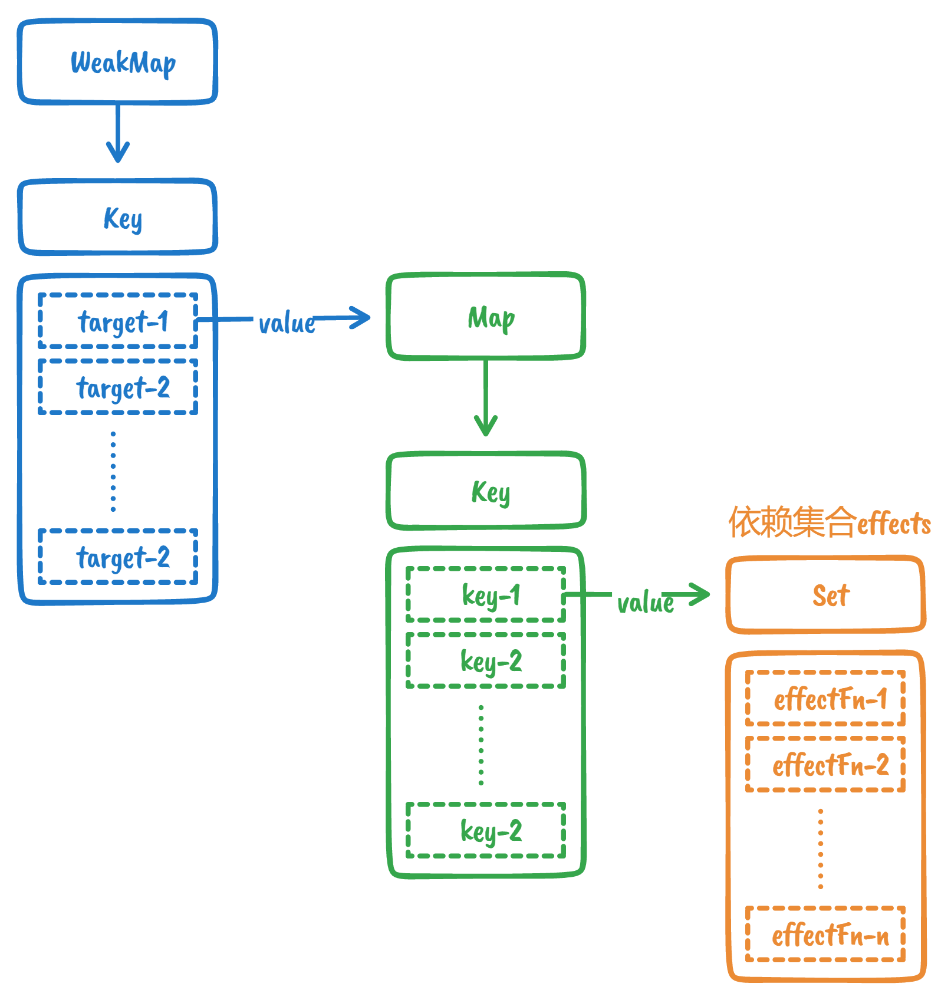

# 读书笔记——响应式系统

> 本文章仅仅是阅读《Vue.js 设计与实现》（霍春阳）后的一些总结和思考，文中的一些文本描述和代码片段来自此书，推荐购买此书阅读，书中包含更多细节

## 副作用函数与响应式数据

- 副作用函数

  会产生副作用（间接或直接**影响其他函数**的执行）的函数

	```javascript
	function effect(){
		document.body.innerText = 'hello vue3'
  	// 此时其他函数都可以读取或者设置 body 的文本内容
	}
	```

- 响应式数据：程序会对该数据的**变化**作出**响应**

  ```javascript
  const obj = {text: 'hello world'}
  function effect(){
    // 函数执行会读取 obj.text
  	document.body.innerText = obj.text
  }
  ```

  当修改 `obj.text` 的值后，我们希望  `body`  的文本内容也随之更新（重新执行副作用函数 `effect` ），这个对象 `obj` 就是响应式数据。

## 响应式数据的基本实现

基本思路：

- 对响应式数据的操作分为两种：1. 读取（一般在副作用函数中） 2. 设置
- **拦截**对象的读取和设置操作，**存储**副作用函数，等到设置操作时重新执行

使用代理对象 [Proxy](https://wangdoc.com/es6/proxy.html) 解决操作拦截，使用 Set  数据结构存储副作用函数。

```javascript
// 存储副作用函数的桶
const bucket = new Set()
// 原始数据
const data = { text: 'hello world' }
// 对原始数据的代理对象
const obj = new Proxy(data, {
  get(target, key) {
    // 读取数据时，将副作用函数存入桶中
    bucket.add(effect)
    return target[key]
  },
  set(target, key, newValue) {
    // 设置属性值
    target[key] = newValue
    // 取出副作用函数重新执行
    bucket.forEach(fn => fn())
    // 返回 true 代表设置操作成功
    return true
  }
})
```

测试

```javascript
// 副作用函数
function effect() {
  document.body.innerText = data.text
}
// 触发读取操作
effect()
// 1秒后修改响应式数据
setTimeout(() => {
  // 触发设置操作
  obj.text = 'hello vue3'
}, 1000);
```


缺陷：当前是硬编码机制，直接通过名字 `effect` 获取副作用函数，不灵活

目标：副作用函数名字可以任意取，甚至是匿名函数

## 设计一个完善的响应系统

由上节看出，一个响应系统的工作流程如下：

- 当读取操作发生时，将副作用函数收集到 “桶” 中
- 当设置操作发生时，从“ 桶 ”中取出副作用函数并执行

### 完善一：硬编码问题

需要解决上一节存在的硬编码副作用函数名字的问题：提供一个用来**注册副作用函数的机制**。

```javascript
// 用一个全局变量存储被注册的副作用函数
let activeEffect
// effect 函数用于注册副作用函数
function effect(fn) {
  // 调用 effect 注册副作用函数时，用全局变量记录
  activeEffect = fn
  // 执行副作用函数
  fn()
}

// 注册匿名副作用函数
effect(
  () => {
    // 读取操作
    document.body.innerText = obj.text
  }
)
```

然后修改 `get` 拦截函数

```javascript
const obj = new Proxy(data, {
  get(target, key) {
    bucket.add(effect) // [!code --]
    // 将 activeEffect 中存储的副作用函数收集到“ 桶 ”中
    if (activeEffect) { // [!code ++]
      bucket.add(activeEffect) // [!code ++]
    } // [!code ++]
    return target[key]
  },
  set(target, key, newValue) {
    // ...
  }
})
```

### 完善二：建立明确联系

对这个系统稍加测试，例如在响应式数据 `obj` 上设置一个不存在的属性：

```js
// 注册匿名副作用函数
effect(
  () => {
    console.log('effect run') // 会打印2次 // [!code hl]
    document.body.innerText = obj.text
  }
)
setTimeout(() => {
  // 副作用函数中并没有读取 notExist 属性的值
  obj.notExist = 'hello vue3' // [!code hl]
}, 1000)

```

问题：匿名副作用函数与 `obj.text` 之间会建立响应联系，但是对 `obj` 对象上其他属性的设置也会触发副作用函数重新执行。

解决：重新设计 “桶” 的数据结构，**在副作用函数<sup>①</sup>与被操作的目标<sup>②</sup>字段<sup>③</sup>之间建立明确的联系**。

以上涉及三个角色：

1. 使用 `effect` 函数注册的副作用函数 `effectFn`

2. 被操作的目标 `target`（代理对象所代理的原始对象）

3. 被操作的字段 `key`（注意和 Map 中的键 Key 作区分）

三者关系如下：



使用 WeakMap 代替 Set 作为桶的数据结构：

```javascript
// 存储副作用
const bucket = new WeakMap()
```

然后修改 `get / set` 拦截器代码：

```javascript
const obj = new Proxy(data, {
  get(target, key) {
    if (activeEffect) {
      // 根据 target 从 “桶” 中取得depsMap，它是 Map 类型：key -> effects 
      let depsMap = bucket.get(target)
      if (!depsMap) {
        bucket.set(target, (depsMap = new Map()))
      }
      // 再根据 key 从depsMap 中取得 deps，它是一个 Set类型
      // 里面存储着所有与当前 key 相关联的副作用函数：effects
      let deps = depsMap.get(key)
      if (!deps) {
        depsMap.set(key, (deps = new Set()))
      }
      // 最后将当前激活的副作用函数添加到桶里
      deps.add(activeEffect)
    }
    // 返回属性值
    return target[key]
  },
  set(target, key, newVal) {
    //设置属性值
    target[key] = newVal
    // 根据 target 从桶中取出 depsMap，它是 key -> effects
    const depsMap = bucket.get(target)
    if (!depsMap) return
    // 根据 key 取出所有副作用函数 effects
    const effects = depsMap.get(key)
    effects && effects.forEach(fn => fn())
  }
})
```

 为什么使用 WeakMap：

WeakMap 对 `key` 是**弱引用**，不影响**垃圾回收器**的工作。例如上面场景中，当用户侧的代码对代理的原数据 `target` 没有任何引用时，它将被回收，若使用 Map，则一直存在与 `key` 中，最终可能导致内存溢出。

最后，对代码进行封装，将收集副作用函数逻辑封装到 `track` 函数中，将触发副作用函数重新执行逻辑 封装到 `trigger` 函数中：

```javascript
const obj = new Proxy(data, {
  get(target, key) {
    track(target, key) // [!code hl]
    // 返回属性值
    return target[key]
  },
  set(target, key, newVal) {
    //设置属性值
    target[key] = newVal
    trigger(target, key) // [!code hl]
  }
})
// 依赖收集
function track(target, key) {
  // 没有 activeEffect，直接return
  if (!activeEffect) return
  let depsMap = bucket.get(target)
  if (!depsMap) {
    bucket.set(target, (depsMap = new Map()))
  }
  // 再根据 key 从depsMap 中取得 deps，它是一个 Set类型
  // 里面存储着所有与当前 key 相关联的副作用函数：effects
  let deps = depsMap.get(key)
  if (!deps) {
    depsMap.set(key, (deps = new Set()))
  }
  // 最后将当前激活的副作用函数添加到桶里
  deps.add(activeEffect)
}
// 触发执行
function trigger(target, key) {
  // 根据 target 从桶中取出 depsMap，它是 key -> effects
  const depsMap = bucket.get(target)
  if (!depsMap) return
  // 根据 key 取出所有副作用函数 effects
  const effects = depsMap.get(key)
  effects && effects.forEach(fn => fn())
}
```

## 分支切换与 cleanup

### 什么是分支切换？

```javascript
const data = {ok: true, text: 'hello, world'}
const obj = new Proxy(data, { /* ... */ })

effect(function effectFn(){
  document.body.innerText = obj.ok ? obj.text : 'not'
})
```

副作用函数 `effectFn` 内部存在一个三元表达式，根据 `obj.ok` 值的不同执行不同的代码分支，这就是所谓分支切换。

**问题**：可能会产生遗留的副作用函数

**分析**：在一开始执行 `document.body.innerText = obj.ok ? obj.text : 'not'` 时，副作用函数会和 `ok` 字段和 `text` 字段都建立联系（被收集到各自的依赖集合）。当字段 `obj.ok` 变为 false，此时的 `document.body.innerText` 值与 `obj.text` 无关，但是副作用函数仍然存在于它的依赖集合中，对 `obj.text` 的设置操作仍会触发副作用函数的执行。

**解决**：每个副作用函数都存储与之相关联的依赖集合，每次副作用函数执行时，将其从相关联的依赖集合中移除，当副作用函数执行完毕后，重新建立联系。

为副作用函数 `effectFn` 添加 `deps` 属性，该属性是一个数组，用来存储所有与该副作用函数相关联（包含它）的依赖集合。

```javascript
// 用一个全局变量存储被注册的副作用函数
let activeEffect
// effect 函数用于注册副作用函数
function effect(fn) {
  const effectFn = () => {
    // effectFn 执行时，将其设置为当前激活的副作用函数
    activeEffect = effectFn
    // 执行副作用函数
    fn()
  }
  // 用来存储所有与该副作用函数相关联的依赖集合
  effectFn.deps = []
  effectFn()
}
```

在 `track` 函数中收集副作用函数的相关依赖集合：

```javascript
function track(target, key) {
  // 没有 activeEffect，直接return
  if (!activeEffect) return
  let depsMap = bucket.get(target)
  if (!depsMap) {
    bucket.set(target, (depsMap = new Map()))
  }
  // 再根据 key 从depsMap 中取得 deps，它是一个 Set类型
  // 里面存储着所有与当前 key 相关联的副作用函数：effects
  let deps = depsMap.get(key)
  if (!deps) {
    depsMap.set(key, (deps = new Set()))
  }
  // 最后将当前激活的副作用函数添加到桶里
  deps.add(activeEffect)
  // deps 就是一个与当前副作用函数存在联系的依赖集合
  // 将其添加到 activeEffect.deps 数组中
  activeEffect.deps.push(deps) // [!code ++]
}
```

副作用函数执行时，根据 `effectFn.deps` 获取所有相关联的依赖集合，将副作用函数从依赖集合中移除：

```javascript
// 用一个全局变量存储被注册的副作用函数
let activeEffect
// effect 函数用于注册副作用函数
function effect(fn) {
  const effectFn = () => {
    // 调用 cleanup 完成清除工作
    cleanup(effectFn) // [!code ++]
    // effectFn 执行时，将其设置为当前激活的副作用函数
    activeEffect = effectFn
    // 执行副作用函数
    fn()
  }
  // 用来存储所有与该副作用函数相关联的依赖集合
  effectFn.deps = []
  effectFn()
}
```

`cleanup` 函数实现：

```javascript
function cleanup(effectFn) {
  for (let i = 0; i < effectFn.deps.length; i++) {
    // 依赖集合 deps
    let deps = effectFn.deps[i]
    // 将 effectFn 从依赖集合中移除
    deps.delete(effectFn)
  }
  // 重置数组
  effectFn.deps.length = 0
}
```

至此，副作用函数遗留问题已经解决。

还需修改 `trigger` 函数避免无限执行。

```javascript
function trigger(target, key) {
  // 根据 target 从桶中取出 depsMap，它是 key -> effects
  const depsMap = bucket.get(target)
  if (!depsMap) return
  // 根据 key 取出所有副作用函数 effects
  const effects = depsMap.get(key)
	// 直接使用 effects 遍历副作用函数 fn 执行可能会导致 fn 先被移除后又被添加进来，导致遍历无法终止
  effects && effects.forEach(fn => fn()) // [!code --]
  // 构建另一个 Set 集合用于遍历
  const effectsToRun = new Set(effects) // [!code ++]
  effectsToRun && effectsToRun.forEach(effectFn => effectFn()) // [!code ++]
}
```

## 嵌套的 effect 与 effect 栈

### 什么是嵌套的 effect ？

例如以下代码，`effectFn1` 内部嵌套 `effectFn2`

```javascript
effect(function effectFn1() {
	effect(function effectFn2() { /* ... */ })
  /* ... */
})
```

### 为什么需要嵌套的 effect ？

例如在 Vue.js 中，渲染函数就是在 `effect` 中执行的：

```javascript
// Foo 组件
const Foo = {
	render() {
    return /* ... */
  }
}
// 在 effect 中执行渲染函数
effect(() => {
	Foo.render()
})
```

当组件嵌套时，就发生了 `effect` 嵌套：

```javascript
// Bar 组件
const Bar = {
	render() { /* ... */ }
}
// Foo 组件渲染了 Bar 组件
const Foo = {
  render() {
    return <Bar /> // jsx 语法
  }
}
```

相当于

```javascript
effect(() => {
	Foo.render()
	// 嵌套
	effect(() => {
		Bar.render()
	})
})
```

### 当前响应式系统对于嵌套 effect 的缺陷

我们用全局变量 `activeEffect` 存储通过 `effect` 函数注册的副作用函数，这意味着同一时刻 `activeEffect` 所存储的被激活函数只能有一个，所以内层嵌套的副作用函数执行会直接覆盖 `activeEffect` 值，且在执行后无法恢复，导致在外层副作用函数中响应式收集到的副作用函数都会是内层副作用函数。

为解决这一问题，需要一个副作用函数栈来解决层级关系，使得 `activeEffect` 的值能够还原。

### effect 栈

定义 `effectStack` 数组来模拟栈，`activeEffect` 仍然指向当前被激活的副作用函数，但是在副作用函数执行前，将其压入栈顶，等执行完毕，将其弹出，`activeEffect` 还原为上层副作用函数。

```javascript
// 用一个全局变量存储当前激活的副作用函数
let activeEffect
// effect 栈
const effectStack = [] // [!code ++]
// effect 函数用于注册副作用函数
function effect(fn) {
  const effectFn = () => {
    // 调用 cleanup 完成清除工作
    cleanup(effectFn)
    // effectFn 执行时，将其设置为当前激活的副作用函数
    activeEffect = effectFn
    // 在调用副作用函数之前将当前副作用函数压入栈顶
    effectStack.push(effectFn) // [!code ++]
    // 执行副作用函数
    fn()
    // 在当前副作用函数执行完毕后，将其弹出，并将 activeEffect 还原为之前的值
    effectStack.pop() // [!code ++]
    activeEffect = effectStack[effectStack.length - 1] // [!code ++]
  }
  // 用来存储所有与该副作用函数相关联的依赖集合
  effectFn.deps = []
  effectFn()
}
```

## 避免无限递归循环

**问题**：

```javascript
const data = { foo: 1 }
const obj = new Proxy(data, { /* ... */})

effect(() => obj.foo++)
```

上述代码会引起栈溢出。

**分析**：

`obj.foo++` 可以看作 `obj.foo = obj.foo + 1` ，这个语句中既有对 `obj.foo` 的读取操作，又有对 `obj.foo` 的设置操作。首先读取 `obj.foo` 的值，会触发 `track` 操作，收集副作用函数，接着赋值给 `obj.foo`，触发 `trigger` 操作，取出副作用函数执行，此时一开始的副作用函数都还没有执行完，导致无限递归地调用自己，于是产生了栈溢出.

**解决**：

在 `trigger` 操作前增加守卫条件：**如果 `trigger` 触发执行的副作用函数与当前正在执行的副作用函数相同，则不触发执行**。

```javascript
function trigger(target, key) {
  // 根据 target 从桶中取出 depsMap，它是 key -> effects
  const depsMap = bucket.get(target)
  if (!depsMap) return
  const effects = depsMap.get(key)

  const effectsToRun = new Set(effects) // [!code --]
  const effectsToRun = new Set() // [!code ++]
  // 如果 trigger 触发执行的副作用函数与当前正在执行的副作用函数相同，则不触发执行 // [!code ++]
  effects && effects.forEach(effectFn => { // [!code ++]
    if (effect !== activeEffect) { // [!code ++]
      effectsToRun.add(effectFn) // [!code ++]
    } // [!code ++]
  }) // [!code ++]
  effectsToRun.forEach(effectFn => effectFn())
}
```

## 调度执行

所谓可调度，指的是**当 `trigger` 动作触发副作用函数重新执行时，有能力决定副作用函数执行的时机、次数以及方式**。

为 `effect` 函数设计一个选项参数 `options`，允许用户指定调度器：

```javascript
effect(
  () => {
    console.log(obj.foo)
  },
  // options
  {
    // 调度器 scheduler 是一个函数
    scheduler(fn) {
      // ...
    }
  }
)
```

在 `effect` 内部将 `options` 选项挂载到对应的副作用函数上：

```javascript
function effect(fn, options = {}) {
  const effectFn = () => {
    // ...
  }
  // 将 options 挂载到 effectFn 上 // [!code ++]
  effectFn.options = options // [!code ++]
  // 用来存储所有与该副作用函数相关联的依赖集合
  effectFn.deps = []
  effectFn()
}
```

有了调度函数，我们在 `trigger` 动作中触发副作用函数重新执行时，就可以直接调用用户传递的调度器函数，从而把控制权交给用户。

```javascript
function trigger(target, key) {
  const depsMap = bucket.get(target)
  if (!depsMap) return
  const effects = depsMap.get(key)

  const effectsToRun = new Set()
  effects && effects.forEach(effectFn => {
    if (effect !== activeEffect) {
      effectsToRun.add(effectFn)
    }
  })
  
  effectsToRun.forEach(effectFn => {
    // 如果一个副作用函数存在调度器，则调用该调度器，并将副作用函数作为参数传递
    if (effectFn.option.scheduler) {  // [!code ++]
      effectFn.option.scheduler(effectFn)  // [!code ++]
    } else {
      // 否则直接执行（默认行为）
      effectFn()
    }
  })
}
```

用户通过调度器可以获得当前副作用函数，自己控制如何执行，例如：

```javascript
const data = { foo: 1}
const obj = new Proxy(data, { /* ... */ })

effect(
  () => {
    console.log(obj.foo)
  },
  // options
  {
    // 改变副作用函数的执行时机，将副作用函数放到宏任务中
    scheduler(fn) { // [!code hl]
      settimeout(fn) // [!code hl]
    } // [!code hl]
  }
)

obj.foo++

console.log('结束了')
```

输出结果：

```
1
'结束了'
2
```

## 计算属性 computed 与 lazy

前文介绍了 `effect` 函数、选项参数 `options`、调度器 `scheduler`、追踪和收集依赖函数 track、触发副作用函数重新执行函数 `trigger`，接下来实现计算属性。

### 懒执行

现在我们实现的 `effect` 函数会立即执行传递给它的副作用函数，例如：

```javascript
effect(
  // 这个函数会立即执行
  () => { console.log(obj.foo) }
)
```

但在有些场景下，我们并不希望它立即执行，而是需要的时候才执行，这就是懒执行。

通过在 `options` 中添加 `lazy` 属性达到目的。

```javascript
effect(
  () => {
    console.log(obj.foo)
  },
  // options
  {
    lazy: true
  }
)
```

修改 `effect` 函数，当 `option.lazy` 为 `true` 时，不立即执行副作用函数。

```javascript
function effect(fn, options = {}) {
  const effectFn = () => {
    cleanup(effectFn)
    activeEffect = effectFn
    effectStack.push(effectFn)
    fn()
    effectStack.pop()
    activeEffect = effectStack[effectStack.length - 1]
  }
  effectFn.options = options
  effectFn.deps = []
  // 只有非 lazy 的时候才执行 
  if(!options.lazy){ // [!code ++]
    effectFn()
  }
  return effectFn // [!code ++]
}
```

当前仅能手动执行副作用函数，意义不大。如果把注册的副作用函数看作一个 `getter`，我们希望能够在手动执行副作用函数时，就能拿到返回值：

```javascript
const effectFn = effect(
	// getter 返回 obj.foo 与 obj.bar 的和
  () => obj.foo + obj.bar,
  { lazy: trure}
)
// value 是 getter 的返回值
const value = effectFn()
```

对 `effect` 函数做一些修改：

```javascript
function effect(fn, options = {}) {
  const effectFn = () => {
    cleanup(effectFn)
    activeEffect = effectFn
    effectStack.push(effectFn)
    // 将 fn 的结果存储在 res 中
    const res = fn() // [!code ++]
    effectStack.pop()
    activeEffect = effectStack[effectStack.length - 1]
    // 将 res 作为 effectFn 的返回值
    return res // [!code ++]
  }
  effectFn.options = options
  effectFn.deps = []
  // 只有非 lazy 的时候才执行
  if(!options.lazy){
    effectFn()
  }
  return effectFn
}

```

现在已经可以实现计算属性了，如下所示：

```javascript
function computed(getter) {
  const effectFn = effect(getter, {
    lazy: true
  })
  const obj = {
    get value() {
      return effectFn()
    }
  }
  return obj
}

const sumRes = computed(() => obj.foo + obj.bar)
console.log(sumRes.value)
```

以上做到了懒计算，但是可以发现，如果多次访问 `sumRes.value` 的值，会导致 `effectFn` 进行多次计算，即使 `obj.foo` 和 `obj.bar` 的值并没有变化，所以还需要对值进行**缓存**。

### 缓存计算值

新增两个变量 `value` 和 `dirty`，`value` 用来缓存上一次计算的值，`dirty` 是一个标识，代表是否需要重新计算。当通过 `sumRes.value` 访问值时，只有 `dirty` 为 `true` 时才调用 `effectFn` 重新计算，否则使用缓存值 `value`。添加调度器，在调度器中将 `dirty` 重置，说明计算值发生改变，下次访问需要重新计算。

```javascript
function computed(getter) {
  // value 用来缓存上一次的计算值
  let value // [!code ++]
  // dirty 标志，用来标识是否需要重新计算值，为 true 标识 “脏”，需要重新计算
  let dirty // [!code ++]
  const effectFn = effect(getter, {
    lazy: true,
    // 添加调度器，在调度器中将 dirty 重置
    scheduler() { // [!code ++]
      dirty = true // [!code ++]
    } // [!code ++]
  })
  const obj = {
    get value() {
      return effectFn() // [!code --]
      if (dirty) { // [!code ++]
        value = effectFn() // [!code ++]
        dirty = false // [!code ++]
      } // [!code ++]
      return value // [!code ++]
    }
  }
  return obj
}
```

### 缺陷

现在还有一个缺陷，体现在当我们在另一个 `effect` 中读取计算属性的值时：

```javascript
const sumRes = computed(() => obj.foo + obj.bar)

effect(() => {
	// 在该副作用函数中读取 sumRes.value
  console.log(sumRes.value)
})

// 修改 obj.foo 的值
obj.foo++
```

**预期结果**：修改 `obj.foo` 的值后，重新打印计算属性 `sumRes` 的值

**实际结果**：没有反应

**分析**：这从本质上看就是 `effect` 嵌套，在读取 `sumRes.value` 时会调用 `computed` 中的 `effect` 。由于外层的 `effect` 不会被内层 `effect` 中的响应式数据收集，对于计算属性的 `getter` 函数来说，它里面访问的响应式数据只会把 `computed` 内部的 `effect` 收集为依赖。所以修改响应式数据 `obj.foo` 值后，外层的 `console.log()` 不会执行。

**解决**：读取计算属性的值时，手动调用 `trigger` 函数收集依赖（外层副作用函数）；当计算属性依赖的响应式数据发生变化时，手动调用 `trigger` 函数触发响应：

```javascript
function computed(getter) {
  let value
  let dirty
  const effectFn = effect(getter, {
    lazy: true,
    scheduler() {
      dirty = true
      // 当计算属性依赖的响应式数据变化时，手动调用 trigger 函数触发响应
      trigger(obj, 'value') // [!code ++]
    }
  })
  const obj = {
    get value() {
      if (dirty) {
        value = effectFn()
        dirty = false
      }
      // 当读取 value 时，手动调用函数 track 追踪/收集依赖
      track(obj, 'value') // [!code ++]
      return value
    }
  }
  return obj
```

## watch 的实现原理

`watch` 本质就是**观测一个响应式书，当数据发生变化时通知并执行响应回调函数**。举个例子：

```javascript
watch(obj, () =>{
  console.log('数据变了')
})
// 修改响应数据的值，会导致回调函数执行
```

watch 的实现利用了 `effect` 以及 `options.scheduler` 选项：

```javascript
function watch(source, callback) {
  effect(
    // 触发读取操作，从而建立联系
    () => source.foo,
    {
      scheduler() {
        // 当数据发生变化时，调用回调函数，而非触发副作用函数执行
        callback()
      }
    }
  )
}
```

上面代码硬编码了对 `source.foo` 的读取操作，只能观测对象 `foo` 属性的变化。然而观测的值可以是该对象上的任意属性也可以是一个 `getter` 函数，所以需要一个通用的读取操作：

```javascript
function watch(source, callback) {
  // 定义getter
  let getter
  // 如果 source 是函数，说明用户传递的是getter，所以直接把 source 赋值给getter
  if (typeof source === 'function') {
    getter = source
  } else {
    // 否则调用 traverse 递归读取
    getter = () => traverse(source)
  }
  effect(
    // 执行 getter
    () => getter,
    {
      scheduler() {
        // 当数据发生变化时，调用回调函数，而非触发副作用函数执行
        callback()
      }
    }
  )
}

function traverse(value, seen = new Set()) {
  // 如果要读取的数据是原始值，或者已经被读取过了，那么说明都不做
  if (typeof value !== 'object' || value === null || seen.has(value)) return
  // 将数据添加到 seen 中，代表遍历地读取过了，比那面循环引用引起死循环
  seen.add(value)
  // 暂时不考虑数组等其他结构
  // 假设 value 就是一个对象，使用 for...in 读取对象的每一个值，并递归地调用 traverse 进行处理
  for (const k in value) {
    traverse(value[k], seen)
  }
  return value
}
```

现在还缺少一个重要功能：回调中拿到变化前后的值。可以利用 `effect` 函数的 `lazy` 选项，如下代码所示：

```javascript
function watch(source, callback) {
  let getter
  if (typeof source === 'function') {
    getter = source
  } else {
    getter = () => traverse(source)
  }

  let oldValue, newValue // [!code focus:17]
  const effectFn = effect(
    () => getter,
    {
      lazy: true,
      scheduler() {
        // 当响应式数据变化，在 scheduler 中重新执行副作用函数，得到的是新值
        newValue = effectFn()
        // 将旧值和新值作为回调函数的参数
        callback(oldValue, newValue)
        // 更新旧值
        oldValue = newValue
      }
    }
  )
  // 第一次手动副作用函数，拿到的是旧值（初始值）
  oldValue = effectFn()
}
```

## 立即执行的 watch 与回调执行时机

上节介绍了 `watch` 的基本实现。本节继续讨论关于 `watch` 的两个特性：

1. 立即执行的回调函数
2. 回调函数的执行时机

### 立即执行的回调函数

默认情况下，`watch` 是懒执行的，可以通过选项参数 `immediate` 来指定回调是否需要立即执行：

```javascript
watch(obj, () => {
  console.log('变化了')
}, {
  // 回调函数在 watch 创建时立即执行一次
  immediate: true
})
```

可以把 `scheduler` 调度函数封装为一个通用函数 `job`，分别在初始化和变更时执行它：

```javascript
function watch(source, callback) {
  let getter
  if (typeof source === 'function') {
    getter = source
  } else {
    getter = () => traverse(source)
  }

  let oldValue, newValue

  // 提取 scheduler 调度函数为一个独立的 job 函数
  const job = () => {
    newValue = effectFn()
    callback(oldValue, newValue)
    oldValue = newValue
  }
  const effectFn = effect(
    () => getter,
    {
      lazy: true,
      scheduler: job
    }
  )
  if (options.immediate) {
    // 当 immediate 为 true 时立即执行 job，触发回调执行,此时 oldValue 为 undefined
    job()
  } else {
    oldValue = effectFn()
  }
}
```

### 回调函数的执行时机

除了指定回调函数为立即执行外，还可以通过 `flush` 选项参数指定回调函数的执行时机：

```javascript
watch(obj, () => {
  console.log('变化了')
}, {
  flush: 'pre' // 默认 ‘pre’，还可以指定为 ‘post’ | ‘sync’
})
```

当 `flush` 的值为 `'post'` 时，代表调度函数需要将副作用函数放到一个微任务队列中，并等待 DOM 更新结束后再执行。用如下代码模拟：

```javascript
function watch(source, callback) {
  let getter
  if (typeof source === 'function') {
    getter = source
  } else {
    getter = () => traverse(source)
  }

  let oldValue, newValue

  // 提取 scheduler 调度函数为一个独立的 job 函数
  const job = () => {
    newValue = effectFn()
    callback(oldValue, newValue)
    oldValue = newValue
  }
  const effectFn = effect(
    () => getter,
    {
      lazy: true,
      scheduler: job // [!code --]
      scheduler: () => { // [!code ++]
        if (options.flush === 'post') { // [!code ++]
          const p = Promise.resolve() // [!code ++]
          p.then(job) // [!code ++]
        } else { // [!code ++]
          // 这里直接执行，本质上相当于 ’sync‘ 的实现模拟
          job() // [!code ++]
        } // [!code ++]
      }
    }
  )
  if (options.immediate) {
    // 当 immediate 为 true 时立即执行 job，触发回调执行,此时 oldValue 为 undefined
    job()
  } else {
    oldValue = effectFn()
  }
}
```

对于 `options.flush` 为 `'pre'` 的情况（在组件更新前），暂时还没有办法模拟，因为这涉及组件的更新时机。

## 过期的副作用

在多线程或多进程编程中可能会出现竞态问题。

### 什么是竞态问题

举个例子：

```javascript
let finalData

watch(obj, async() => {
  // 发送并等待网络请求
  const res = await fetch('/path/to/request')
  // 将请求结果赋值给 finalDate
  finalData = res
})
```

`watch` 侦听 `obj` 对象变化，每次 `obj` 对象发生变化都会发送网络请求，等数据请求成功后，将结果赋值给 `finalData` 变量。

假设修改两次 `obj` 对象，先后发送了两次请求：请求 A 和请求 B。但是请求 B 的数据先返回，请求 A 的数据后返回，并覆盖了 请求 B 返回的数据，而我们希望变量 `finalData` 存储的应该是最近一次请求（请求 B）返回的结果，而非请求 A 的返回结果。

### 过期回调

为了解决上述例子的竞态问题，应该在 `watch` 的回调中添加一个**过期标志**，如果当前副作用函数的执行已经过期，其产生了结果应被视为无效。

那么如何记录副作用函数是否过期呢？

在 `watch` 函数的回调中接收第三个参数 `onCleanup`，它是一个函数，用来**注册过期回调** `cleanupFn`。副作用函数被触发时通过 `onCleanup` 注册过期回调，**当 `watch` 内部再次检测到变更，下一次副作用函数要被触发时，说明之前的副作用函数已经过期，执行已被注册的副作用函数**。

```javascript
watch(obj, async (newValue, oldValue, onCleanup) => {
  // 定义一个标志，代表当前副作用函数是否过期，默认为 false，代表没有过期
  let expired = false
  // 注册一个过期回调，当前副作用函数过期（下一次副作用函数生效）时执行
  onCleanup(() => {
    expired = true // 利用闭包特性
  })
  const res = await fetch('path/to/request')
  // 只有当该副作用函数的执行没有过期时，才会执行后续操作
  if (!expired) {
    finalData = res
  }
})
```

`watch` 内部实现：

```javascript
function watch(source, callback) {
  let getter
  if (typeof source === 'function') {
    getter = source
  } else {
    getter = () => traverse(source)
  }

  let oldValue, newValue

  // cleanupFn 用来存储用户注册的过期回调
  let cleanupFn // [!code ++]
  // 定义 onCleanup 函数
  function onCleanup(fn){ // [!code ++]
    cleanupFn = fn // [!code ++]
  } // [!code ++]

  const job = () => {
    newValue = effectFn()
    // 在调用 callback 前，先调用过期回调
    if(cleanupFn){ // [!code ++]
      cleanupFn() // [!code ++]
    } // [!code ++]
    callback(oldValue, newValue) // [!code --]
    // 将 onCleanup 作用回调函数的第三个参数，以便用户用来注册过期回调
    callback(oldValue, newValue, onCleanup) // [!code ++]
    oldValue = newValue
  }
  const effectFn = effect(
    () => getter,
    {
      lazy: true,
      scheduler: () => {
        if (options.flush === 'post') {
          const p = Promise.resolve()
          p.then(job)
        } else {
          job()
        }
      }
    }
  )
  if (options.immediate) {
    job()
  } else {
    oldValue = effectFn()
  }
}
```


