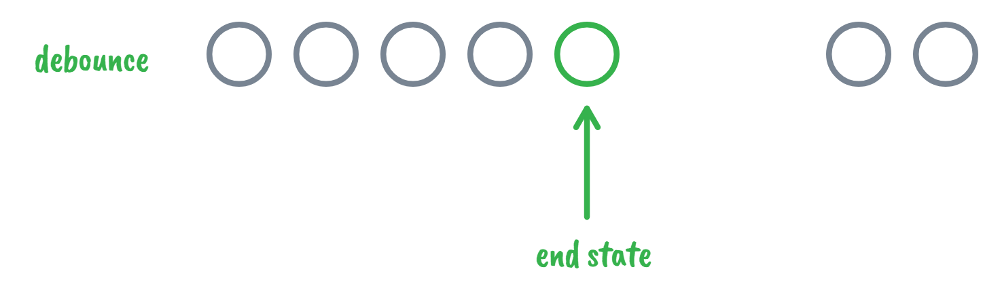
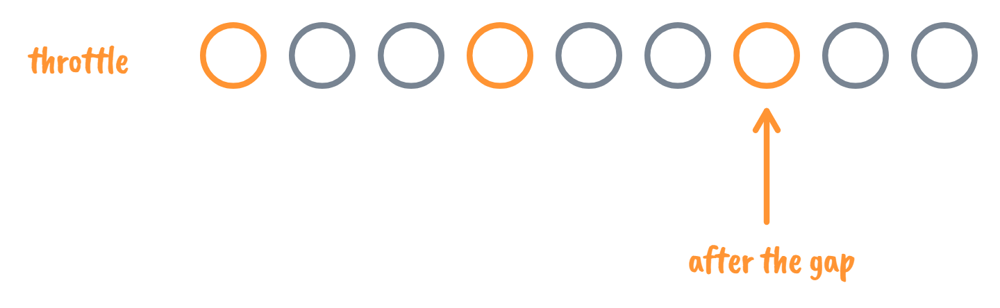

# 防抖和节流

## 防抖（debounce）

> 在一段时间内，将**连续的多次触发事件**转化为只触发一次

### 理解：

- **结束状态**执行
- 技能有蓄力过程，如果被打断了就要重新蓄力



### 应用：

- 用户在输入值时自动联想，一般都是等输入完成后再请求数据，而不是每输入一个字母就发送一次请求（节约请求资源）
- 页面resize触发事件

### 思路：

- 在事件被触发n秒后执行回调，如果在这n秒内再次被触发，则重新计时。

- 在事件初次触发时开启一个定时器，若在设定延时内再次被触发，则清除原有定时器，重新计时。*（利用闭包特性维护特定定时器`timer`）*

### 实现

```javascript
function debounce(fn, wait) {
  let timer = null;
  return function () {
    if (timer) {
      clearTimeout(timer);
    }
    timer = setTimeout(() => {
      fn.apply(this, arguments);
    }, wait);
  };
}
```

```javascript
let debounceFn = debounce((a) => {
  console.log(a);
}, 1000)
debounceFn(1)
debounceFn(2)
// 输出2
```

## 节流（throttle）

> 在一个时间间隔内，不管触发事件多少次，最终只调用执行一次

### 理解：

- **时间间隔**执行
- 技能有冷却时间，在冷却时间内把键盘扣烂了也用不出技能😂
- 漏斗顶部有很多水，本来在1分钟内可以流出很多，现在有了阀门，一分钟内只能流出一滴，所以叫做节流，防止流量过大。



### 应用：

- 监听滚动事件，判断是否滑到底部请求更多资源
- 连续点击刷新，间隔发送请求（提防暴躁多动**手抖**的用户🙂）

### 思路：

- 时间戳：如果当前触发距离上次触发时间间隔大于约定值*（维护`preTime`）*，则可以调用。
- 定时器：事件触发时若存在运行中的定时器*（维护定时器`timer`）*，则不能调用函数，否则可以开启一个定时器调用函数。

## 实现：

```javascript
// 时间戳
// 立即执行（在规定时间开始时执行）
function throttle1(fn, delay) {
  let preTime = 0
  return function () {
    let context = this
    let now = new Date()
    if (now - preTime > delay) {
      fn.apply(context, arguments)
      preTime = now
    }
  };
}

// 定时器
// 最后执行（在规定时间结束时执行）
function throttle2(fn, delay) {
  let timer = null
  return function () {
    if(!timer) {
      timer = setTimeout(() => {
        fn.apply(this, arguments)
        timer = null
      }, delay);
    }
  };
}
```


