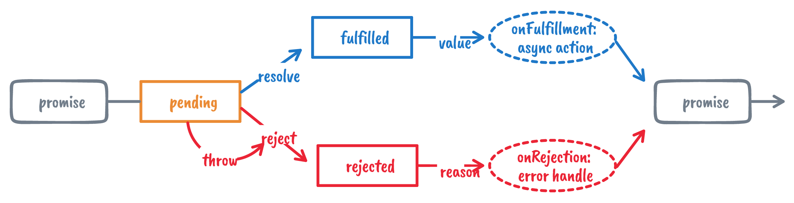
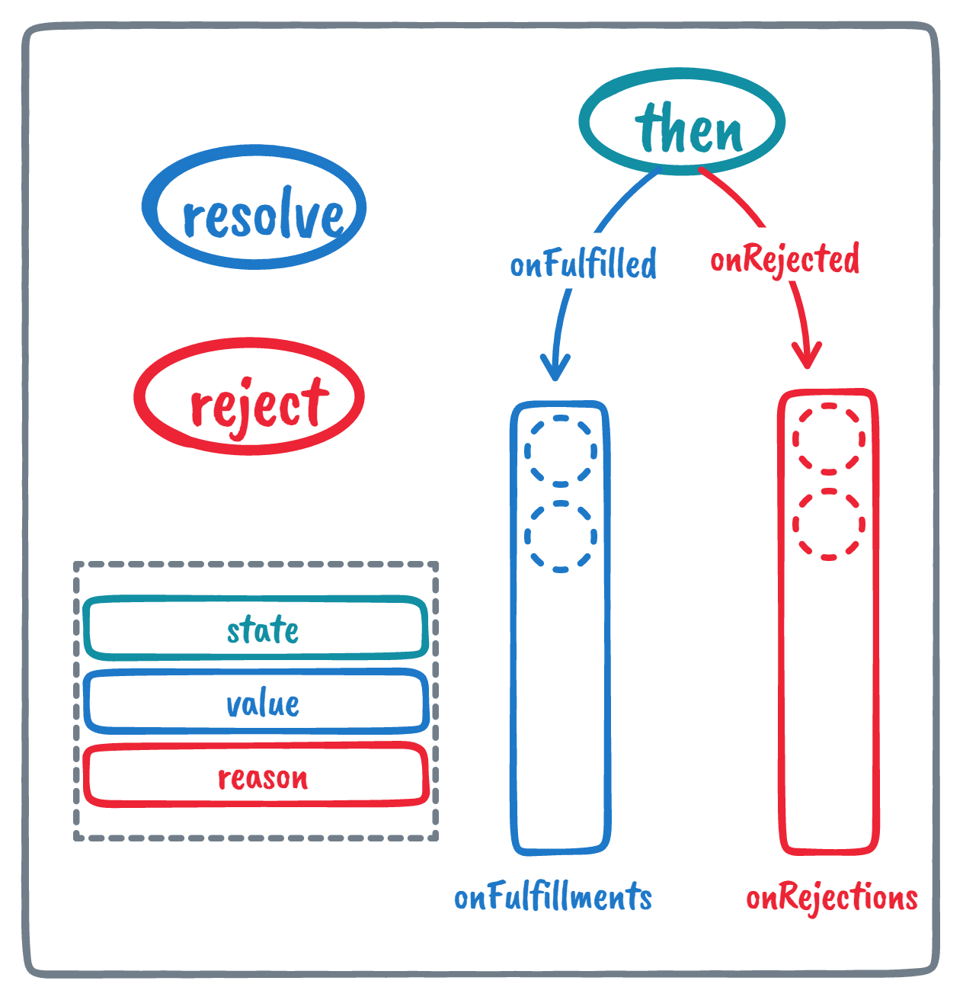
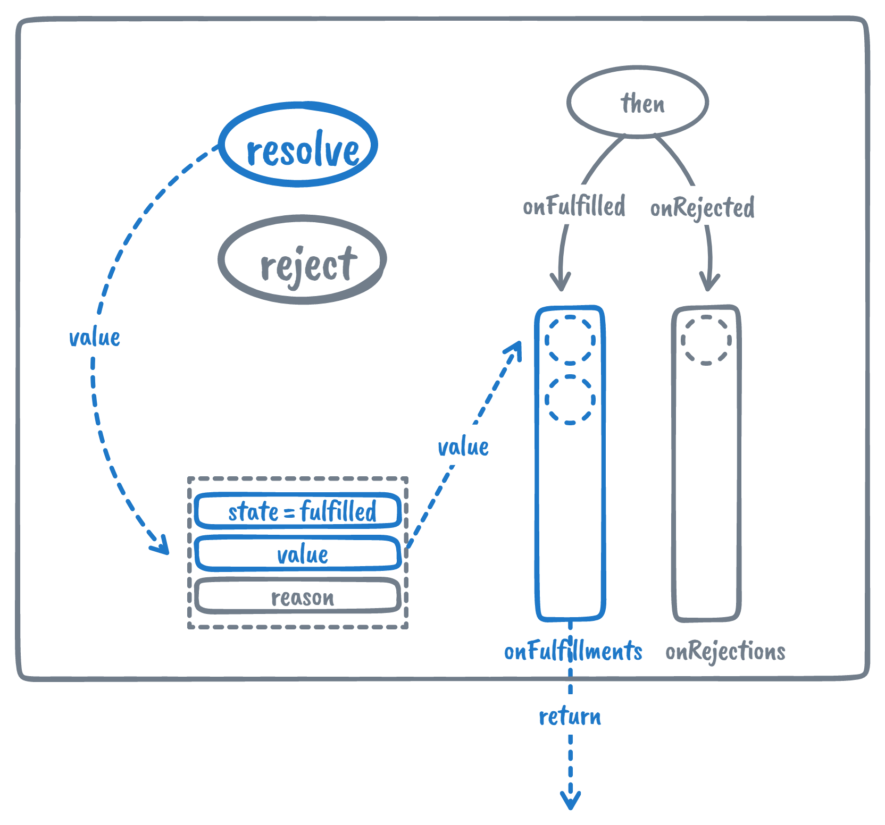
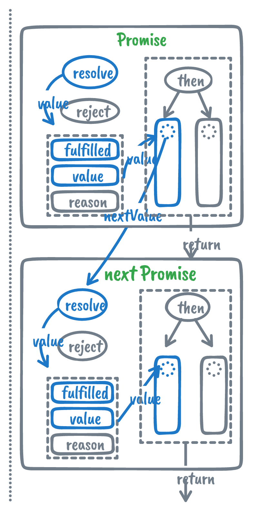
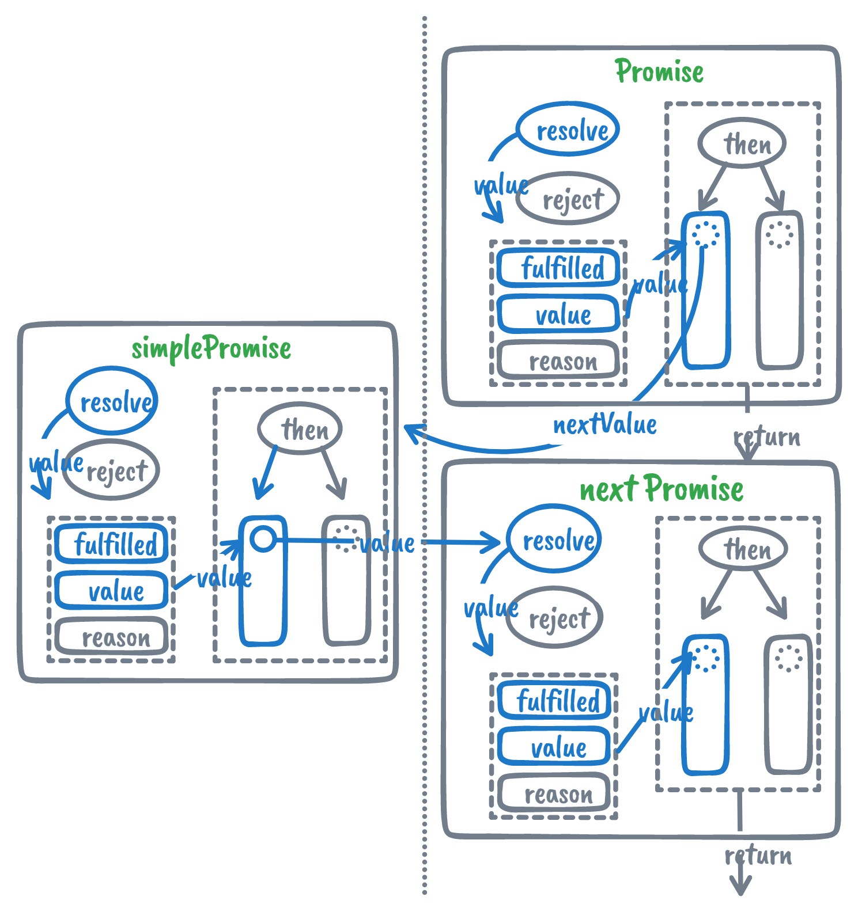

# Promise

> [Promise - JavaScript | MDN](https://developer.mozilla.org/zh-CN/docs/Web/JavaScript/Reference/Global_Objects/Promise)
>
> 一个 Promise 对象代表一个在这个 promise 被创建出来时不一定已知值的代理。**它让你能够把异步操作最终的成功返回值或者失败原因和相应的处理程序关联起来**。这样使得异步方法可以像同步方法那样返回值：**异步方法并不会立即返回最终的值，而是会返回一个 promise，以便在未来某个时候把值交给使用者**。



## 基础结构

首先实现一个基础的 Promise 类，实现以下基本功能。

```javascript
let p = new Promise((resolve, reject) => {
  console.log('异步操作开始')
  setTimeout(() => {
    console.log('异步操作结束')
    resolve('helloWorld')
  }, 1000);
})
p.then((res) => {
  console.log('1.异步结果为:' + res)
})
p.then((res) => {
  console.log('2.异步结果为:' + res)
})
// 输出：
// 异步操作开始
// ****一秒后******
// 异步操作结束
// 1.异步结果为:helloWorld
// 2.异步结果为:helloWorld
```

### 实例属性

- state：存储状态
- value：存储兑现结果
- reason：存储拒绝原因
- onFulfillments：成功回调函数队列
- onRejections：存储失败回调函数队列

### 实例方法

- resolve：给定兑现结果（ value ），将实例状态从pending（待定）改为fulfilled（已兑现），并传参给成功回调函数执行
- reject：给定拒绝原因（reason），将实例状态从pending（待定）定为rejected（已拒绝），并传参给成功回调函数执行

### 原型方法

- then：注册成功回调函数（onFulfilled）和失败回调函数（onRejected），如果当前状态为待定（pending），则加入相应回调队列中等待状态改变后执行，否则直接执行





通过以上结构，可以为一个 promise 实例存储多个回调，通过状态管理，只有在实例状态从 pending 变为 fulfilled / rejected 时才执行成功 / 失败回调，从而解决了异步问题：「**让你能够把异步操作最终的成功返回值或者失败原因和相应的处理程序关联起来**」

### 主要流程（以 resolve 为例）



### 代码实现

```javascript
class Promise {
  // ES2022类的实例属性新写法
  state = 'pending'
  value = null
  reason = null
  onFullfillments = []
  onRejections = []

  constructor(executor) {
    let resolve = (value) => {
      // 状态固定，不能多次改变
      if(this.state !== 'pending') return
      this.state = 'fulfilled'
      this.value = value
      this.onFullfillments.forEach(fn => fn(value))
    }

    let reject = (reason) => {
      if(this.state !== 'pending') return
      this.state = 'rejected'
      this.reason = reason
      this.onRejections.forEach(fn => fn(reason))
    }

    try {
      executor(resolve, reject)
    } catch (error) {
      // 抛出错误直接reject
      reject(error)
    }
  }
	// 注册成功回调和失败回调
  then(onFullfilled, onRejected) {
    // 处于已敲定状态（fulfilled / rejected）直接执行
    if(this.state === 'fulfilled') {
      onFullfilled(this.value)
    }
    if(this.state === 'rejected') {
      onRejected(this.reason)
    }
    // 处于待定状态（pending）加入队列
    if(this.state === 'pending') {
      this.onFullfillments.push(onFullfilled)
      this.onRejections.push(onRejected)
    }
  }
}
```

## 链式调用

> Promise 的链式调用：将进一步的操作与一个变为已敲定状态的 promise 关联起来。


```javascript
PromiseA
  .then(handleResolvedA) // return promiseB
  .then(handleResolvedB) // return promiseC
  .then(handleResolvedC) // return promiseD
```

如上链式操作，promiseB 需要等待 PromiseA 状态敲定，promiseC 需要等待 promiseB 状态敲定，promiseD 需要等待 promiseC 敲定，形成嵌套结构。

```javascript
(promise D, (promise C, (promise B, (promise A) ) ) )
```


基础结构中 then 函数并没有返回值，所以无法继续进行下一环操作。要实现链式调用，就要规定 then 函数返回一个新的 promise 实例以便后续调用。

```javascript
then(onFullfilled, onRejected) {
    let nextPromise = new Promise((resolve, reject) => {
      if (this.state === 'fulfilled') {
        ...
      }

      if (this.state === 'rejected') {
				...
      }

      if (this.state === 'pending') {
        ...
      }
    })
    return nextPromise
  }
```

显然，接下来要解决的是将这个新的 promise 实例和上一个实例建立联系，于是可以定义一个函数 `resolvePromise`

### resolvePromise

新的实例和上一个实例有什么联系呢？

简单来说，上一个实例的回调返回值决定了新实例的状态。所以我们需要在原来的回调函数上再包装一层，获得 onFulfilled / onRejected 函数的返回值 nextValue 后再利用 resolvePromise 函数改变新实例的状态。

```javascript {9,14,20,25}
class Promise {
  ...
  constructor(executor) {...}
  then(onFulfilled, onRejected) {
    let nextPromise = new Promise((resolve, reject) => {
      if (this.state === 'fulfilled') {
        let nextValue = onFulfilled(this.value)
        // 改变新实例状态
        resolvePromise(nextPromise, nextValue, resolve, reject)
      }

      if (this.state === 'rejected') {
        let nextValue = onRejected(this.reason)
        resolvePromise(nextPromise, nextValue, resolve, reject)
      }

      if (this.state === 'pending') {
        this.onFulfillments.push((value) => {
          let nextValue = onFullfilled(value)
          resolvePromise(nextPromise, nextValue, resolve, reject)
        })

        this.onRejections.push((reason) => {
          let res = onRejected(reason)
          resolvePromise(nextPromise, res, resolve, reject)
        })
      }
    })
    return nextPromise
  }
}
```


由于只有 resolve 和  reject 方法可以改变 promise 实例状态，所以函数 resolvePromise 的参数有四个：

- nextPromise：传递的新实例对象 nextPromise（因为上一个 promise 的状态敲定而需要改变）
- nextValue：上一个 promise 的回调返回值
- resolve：新实例对象 nextPromise 的 resolve 方法，用来改变新实例对象状态
- reject：新实例对象 nextPromise 的 reject 方法，用来改变新实例对象状态


根据回调返回值 nextValue 分以下三种情况：

- 抛出错误：

  `reject(error)`，nextPromise 成为已拒绝状态（rejected），error 存储为拒绝理由

- 普通值 / undefined：

  `resolve(nextValue)`，nextPromise 成为已兑现状态（ fulfilled ），nextValue存储为兑现结果。流程如下图所示：



- Promise / thenable Object：

  > thenable对象可以看作类似promise的对象，这里先不考虑它

  暂且将这个回调返回的 promise 叫做 simplePromise，此时 nextPromise 状态同步于 simplePromise。

  那么如何做到同步呢？

  在 promise 状态更新时会执行对应回调并传递兑现结果 value / 拒绝理由 reason ，所以，我们需要给这个 simplePromise 注册**特殊**的成功 / 失败回调（调用它的 then 方法）。当它的状态改变时，可以在回调中拿到对应的兑现结果 / 拒绝理由，利用 nextPromise 的 resolve / reject 方法改变 nextPromise 的状态，做到同步。
  
  流程图以兑现（ fulfilled ）状态的 simplePromise 为例：



以上实现了「**异步方法并不会立即返回最终的值，而是会返回一个 promise，以便在未来某个时候把值交给使用者**」

### 函数代码实现

```javascript
function resolvePromise(nextPromise, nextValue, resolve, reject) {
  // 循环引用报错，不能返回自身
  if (nextPromise === nextValue) {
    return reject(new TypeError('Chaining cycle detected for promise #<Promise>'))
  }

  // 成功回调和失败回调二选一，只有一种状态
  let called = false

  if (nextValue !== null && (typeof nextValue === 'object' || typeof nextValue === 'function')) {
    try {
      let then = nextValue.then
      if (typeof then === 'function') {
        // thenable / PromiseLike对象
        // 调用then方法，注册特殊回调实现状态同步
        then.call(
          nextValue,
          // 成功回调
          (value) => {
            if (called) return
            called = true
            resolvePromise(nextPromise, value, resolve, reject)
          },
          // 失败回调
          (reason) => {
            if (called) return
            called = true
            reject(reason)
          })
      } else {
        // 普通对象
        resolve(nextValue)
      }
    } catch (error) {
      // 抛出错误直接拒绝
      if (called) return
      called = true
      reject(error)
    }
  } else {
    // 普通值直接兑现
    resolve(nextValue)
  }
}
```

## 其他规范

- 如果该 onFulfilled 不是函数，则会在内部被替换为 `(x) => x`，即原样返回 promise 最终结果的函数

- 如果 onRejected 不是函数，则会在内部被替换为一个 "Thrower" 函数 （将接收到的参数作为错误抛出 `(reason) => throw reason`）
- onRejected / onRejected 属于微任务，代码在执行的时候，遇到.then (fn)， 会把fn加入到微任务队列，这里利用setTimeout模拟

- 如果onFulfilled或onRejected报错，则直接返回reject()

## 完整代码

:::details  The complete code
```javascript
class Promise {
  state = 'pending'
  value = null
  reason = null
  onFullfillments = []
  onRejections = []

  constructor(executor) {
    let resolve = (value) => {
      // 不能再次改变状态
      if (this.state !== 'pending') return
      this.state = 'fulfilled'
      this.value = value
      this.onFullfillments.forEach(fn => fn(value))
    }

    let reject = (reason) => {
      if (this.state !== 'pending') return
      this.state = 'rejected'
      this.reason = reason
      this.onRejections.forEach(fn => fn(reason))
    }

    try {
      executor(resolve, reject)
    } catch (error) {
      reject(error)
    }
  }

  then(onFulfilled, onRejected) {
    // onFulfilled如果不是函数，就忽略onFulfilled，直接返回value
    onFulfilled = typeof onFulfilled === 'function' ? onFulfilled : value => value;
    // onRejected如果不是函数，就忽略onRejected，直接扔出错误
    onRejected = typeof onRejected === 'function' ? onRejected : err => { throw err };
    
    let nextPromise = new Promise((resolve, reject) => {
      if (this.state === 'fulfilled') {
        // 模拟微任务
        setTimeout(() => {
          try {
            let nextValue = onFulfilled(this.value)
            resolvePromise(nextPromise, nextValue, resolve, reject)
          } catch (e) {
            reject(e)
          }
        }, 0);
      }

      if (this.state === 'rejected') {
        setTimeout(() => {
          try {
            let nextValue = onRejected(this.reason)
            resolvePromise(nextPromise, nextValue, resolve, reject)
          } catch (e) {
            reject(e)
          }
        }, 0);
      }

      if (this.state === 'pending') {
        // 将回调函数加入队列
        this.onFullfillments.push((value) => {
          setTimeout(() => {
            try {
              let nextValue = onFulfilled(value)
              resolvePromise(nextPromise, nextValue, resolve, reject)
            } catch (e) {
              reject(e)
            }
          }, 0);
        })

        this.onRejections.push((reason) => {
          setTimeout(() => {
            try {
              let nextValue = onRejected(reason)
              resolvePromise(nextPromise, nextValue, resolve, reject)
            } catch (e) {
              reject(e)
            }
          }, 0);
        })
      }
    })
    return nextPromise
  }
}

/**
* @function 为嵌套的promise实例建立联系
* @description 根据回调返回值修改实例状态
* @param nextPromise: then中需要传递的新promise
* @param resolve: 新promise的resolve方法
* @param reject: 新promise的reject方法
* @return void
*/
function resolvePromise(nextPromise, nextValue, resolve, reject) {
  // 循环引用报错，不能返回自身
  if (nextPromise === nextValue) {
    return reject(new TypeError('Chaining cycle detected for promise #<Promise>'))
  }

  // 成功回调和失败回调二选一，只有一种状态
  let called = false

  if (nextValue !== null && (typeof nextValue === 'object' || typeof nextValue === 'function')) {
    try {

      let then = nextValue.then
      if (typeof then === 'function') {
        // thenable / PromiseLike对象
        // 调用then方法，注册特殊回调
        then.call(
          nextValue,
          // 成功回调
          (value) => {
            if (called) return
            called = true
            resolvePromise(nextPromise, value, resolve, reject)
          },
          // 失败回调
          (reason) => {
            if (called) return
            called = true
            reject(reason)
          })
      } else {
        // 普通对象
        resolve(nextValue)
      }
    } catch (error) {
      if (called) return
      called = true
      reject(error)
    }
  } else {
    // 普通值
    resolve(nextValue)
  }
}
```
:::

## 语法糖实现


