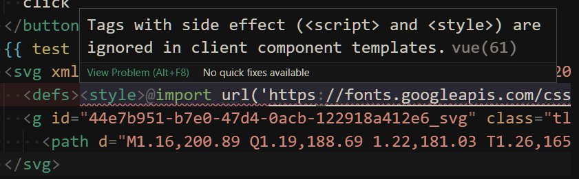

# 开发一个 vite 插件——svmg

> 博客中存在许多使用 tldraw、Excaildraw 等绘图工具绘制的透明背景图片，为配合深浅主题切换，图片需要使用兼容深浅背景的颜色，但是显示效果并不是很好，所以需要一种方式来解决。

## 预期效果

图片中的颜色跟随主题背景变化并且不需要存储两套图片文件或使用 filter 滤镜。

## 初步分析

当前使用的主题切换方案如下：

```javascript
document.documentElement.classList.toggle('dark')
```
```css
:root {
--test-color: #000;
}
.dark {
--test-color: #fff;
}
```

当前图片资源引入方式：

通过 img 标签的 src 属性，客户端会向服务端发送请求，获得对应 src 路径下的资源然后返回客户端。

## 初步设想

将原先从绘图工具中导出的 png 文件都换成 svg 文件，当客户端在请求对应静态资源时，将 svg 内容中的特定颜色替换为为 css 变量后再返回客户端。

例如，使用 transform 钩子，在请求 svg 文件是将颜色内容替换，`fill="#000"` 替换为 `fill="var(--test-color)"`

但是这并没有用，svg 嵌入 img 后 var 失效，不会跟随主题变化。

除非在主题切换时能重新请求 svg 资源将其中的颜色值换成目标主题下的颜色值，但是这种方式会太麻烦，并且会增加网络压力。

所以想在 img 标签上做文章貌似行不通😒。

## 另辟蹊径

只能采用更暴力的方式，在加载 vue 或 html 文件时，直接将其中引入 svg 资源的 img 标签更换为相应 svg 内容。

::: warning

从绘图软件中导出的 svg 中可能包含了引入资源的 `<style>` 标签，它会在 vue 中报错，所以应该把这些样式标签统一移到外面，在 svg 中删除。



:::

## 解决方案

使用 load 钩子，找到需要处理的 vue 或 html 文件（包含引入 svg 图片的 img 标签），然后进行以下步骤：

1. 读取配置，根据配置生成 css 变量内容写入 vue 文件

   例如以下配置：

   ```javascript
   { 
     root: {
       white: '#1d1d1d'
     }, 
     dark: {
       white: '#ffffff' 
     } 
   }
   ```
   需生成以下 CSS 代码

   ```css
   :root {
     --tg-white: #1d1d1d;
   }
   .dark {
     --tg-white: #ffffff;
   }
   ```

   在此过程中，使用 Map 对象存储需要处理的颜色值，例如上述配置会获得如下 colorMap：

   ```
   Map(1) { '--tg-white' => '#1d1d1d' }
   ```

2. 将 svg 中需要处理的颜色值换成对应 css 变量

  例如以下 svg 元素中 fill 属性：

  ```css
  fill="#1d1d1d"
  ```

  替换为：

  ```css
  fill="var(--tg-white)"
  ```

3. 将 img 标签整个替换为处理过后的 svg 内容

## 最后

具体实现代码比较简单，可见 github 仓库 [vite-plugin-svmg](https://github.com/ylw5/vite-plugin-svmg)

当然，目前该方案还存在许多缺陷，仅满足了个人简单需求。例如：

- 直接将 img 替换 成了 svg，无法同步原有 img 标签样式和其他相关属性，渲染结果可能存在差异，仅适用简单场景

- 不兼容其他的主题切换方式

  例如以下方式：

  ```javascript
    document.documentElement.setAttribute('theme', 'dark')
    document.documentElement.removeAttribute('theme', 'dark')
  ```
    ```css
    :root {
    	--test-color: #000;
    }
    :root[theme='dark'] {
    	--test-color: #fff;
    }
    ```

还有许多方面可以完善 TODO：

- 预设主题颜色（适配各种绘图工具），不需手动配置，可以直接引入
- 分离 fill stroke shadow 等颜色配置

未完待续……

如果你也有同样的需求，可以试试这个插件，欢迎提 Issue 或 PR！😊
